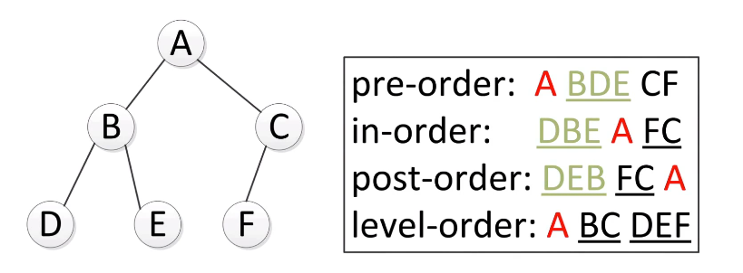

## 二叉树

> 树问题的解法贯穿着递归思想！🚀

### 树

树是一种能够分层储存数据的重要数据结构，树中的每个元素被称为树的节点，每个节点有若干个指针指向子节点。

从节点的角度来看，树是由唯一的起始节点引出的节点集合。这个起始结点称为根(root)。树中节点的子树数目称为节点的度(degree)。

### 二叉树

二叉树，是指对于树中的每个节点而言，至多有左右两个子节点，即任意节点的度小于等于2

二叉树的第`i`层至多有`2^{i-1}`个结点，深度为`k`的二叉树至多有`2^k-1`

```c++
class TreeNode {
public:
    TreeNode *left;
    TreeNode *right;
    TreeNode *parent;  // 可以省略
    int val;
};

class BinaryTree {
public:
    BinaryTree(int rootvalue);
    ~BinaryTree();
    bool insertNodeWithValue(int value);
    bool deleteNodeWithValue(int value);
    void printTree();
private:
    TreeNode *root;
 };
```

### 相关概念

#### 满二叉树（full binary tree）

一棵深度为`k`且有`2^k-1`个结点的二叉树称为**满二叉树**（教材定义）

#### 完全二叉树（complete binary tree）

完全二叉树是由满二叉树而引出来的。对于深度为k的，有n个结点的二叉树，当且仅当其每一个结点都与深度为k的满二叉树中编号从1至n的结点一一对应时，称之为**完全二叉树**（教材定义）

### 二叉树的遍历

#### 先序、中序、后序遍历

三种遍历方式都是**深度优先**算法（depth-first search，dfs），深度优先算法最自然的实现方式是通过**递归**实现，事实上，大部分树相关的面试问题都可以优先考虑递归。

深度优先的算法往往都可以通过使用**栈**数据结构将递归化为**非递归**实现。

递归实现

```c++
void pre0rderTraversal(TreeNode *root) {
    if (!root) {
        return;
    }
    visit(root) ;
    pre0rderTraversal(root->left);
    pre0rderTraversal(root->right);
}
void inOrderTraversal(TreeNode *root) {
    if (!root) {
        return;
    }
    inOrderTraversal(root->left);
    visit(root);
    in0rderTraversal(root->right);
}
void postOrderTraversal(TreeNode *root) {
    if (!root) {
        return;
    }
    postOrderTraversal(root->left);
    postOrderTraversal(root->right);
    visit(root);
}
```

迭代实现（画图帮助理解）

```c++
// 先序遍历
vector<int> preorderTraversal(TreeNode *root) {
    vector<int> result;
    if (root == NULL) return result; // root == nullptr 异常处理

    stack<TreeNode*> s;
    s.push(root);
    while (!s.empty()) {
        TreeNode *node = s.top();
        s.pop();
        result.push_back(node->val);
        if (node->right != NULL) {  // 由于栈的先进后出性，所以先push(right)后push(left)
            s.push(node->right);
        }
        if (node->left != NULL) {
            s.push(node->left);
        }
    }
    return result;
}
// 中序遍历
vector<int> inorderTraversal(TreeNode* root) {
    stack<TreeNode*> myStack; // 在遍历的过程中维护这个栈
    vector<int> result; // 保存遍历结果

    while(!myStack.empty() || root != nullptr) {
        while(root != nullptr) { // 找到所有的左子结点
            myStack.push(root);
            root = root->left;
        }
        if(root == nullptr) { // 对空结点的处理
            root = myStack.top();
            myStack.pop();
        }
        result.push_back(root->val);
        root = root->right; // 将root指向右结点
    }
    return result;
}
// 后序遍历
vector<int> postorderTraversal(TreeNode* root) {
    vector<int> result;
    if (root == NULL) return result; // root == nullptr 异常处理

    stack<TreeNode*> st;
    st.push(root);
    while (!st.empty()) {
        TreeNode* node = st.top();
        st.pop();
        result.push_back(node->val);
        if (node->left) st.push(node->left); // 相对于前序遍历，这更改一下入栈顺序 （空节点不入栈）
        if (node->right) st.push(node->right); // 空节点不入栈
    }
    reverse(result.begin(), result.end()); // 将结果反转之后就是左右中的顺序了
    return result;
}
```

#### 层次遍历

首先访问第`0`层，也就是根结点所在的层；

当第`i`层的所有结点访问完之后，再从左至右依次访问第`i+1`层的各个结点。

层次遍历属于**广度优先**算法(breadth-first search，bfs)。实现的时候会用到**队列**！



BFS代码

```c++
void levelTraversal(TreeNode *root){
    queue<TreeNode*> nodeQueue;
    TreeNode *currentNode;
    if (!root) {
        return;
    }
    nodeQueue.push(root);
    while (!nodeQueue.empty()) {
        currentNode = nodeQueue.front();
        processNode(currentNode) ;
        if (currentNode->left){
            nodeQueue.push(currentNode->left);
        }
        if (currentNode->right) {
            nodeQueue.push(currentNode->right);
        }
        nodeQueue.pop();
    }
}
```

### 分治算法

#### 步骤：

- 分解（Divide）：将原问题分解为若干子问题，这些子问题都是原问题规模较小的实例。
- 解决（Conquer）：递归地求解各子问题。如果子问题规模足够小，则直接求解。
- 合并（Combine）：将所有子问题的解合并为原问题的解。

#### 应用：

- 二分搜索
- 大整数乘法
- 归并排序
- 快速排序

### Binary Search Tree

二分查找树（Binary Search Tree, BST）是二叉树的一种特例，对于二分查找树的任意节点，该节点储存的数值一定比左子树的所有节点的值大，比右子树的所有节点的值小。

**BST特性**

- 由于二叉树第`L`层至多可以储存`2^L`个节点，故树的高度应在logn量级，因此，二叉搜索树的搜索效率为`O(logn)`。
- 当二叉搜索树退化为一个由小到大排列的单链表（每个节点只有右孩子），其搜索效率变为`O(n)`。

```c++
// 遍历框架
void BST(TreeNode* root, int target) {
    if (root->val == target)
        // 找到目标，做点什么
    if (root->val < target)
        BST(root->right, target);
    if (root->val > target)
        BST(root->left, target);
}
```

### Balanced Binary Tree

一棵二叉树是平衡的，当且仅当左右子树高度差绝对值不超过1，并且左右子树都是平衡二叉树。

### AVL树

AVL树本质上还是一棵二叉搜索树，它的特点是：

- 本身首先是一棵二叉搜索树。

- 带有平衡条件：每个结点的左右子树的高度之差的绝对值（平衡因子）最多为1。

也就是说，AVL树，本质上是带了**平衡功能的二叉查找树**（二叉排序树，二叉搜索树）。
