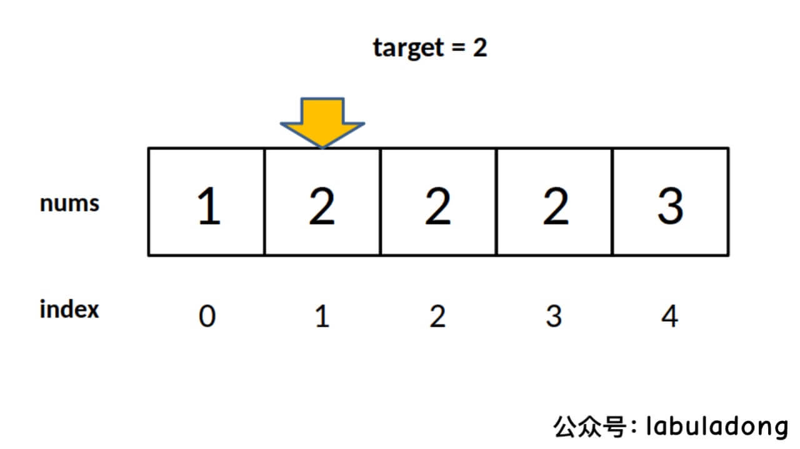
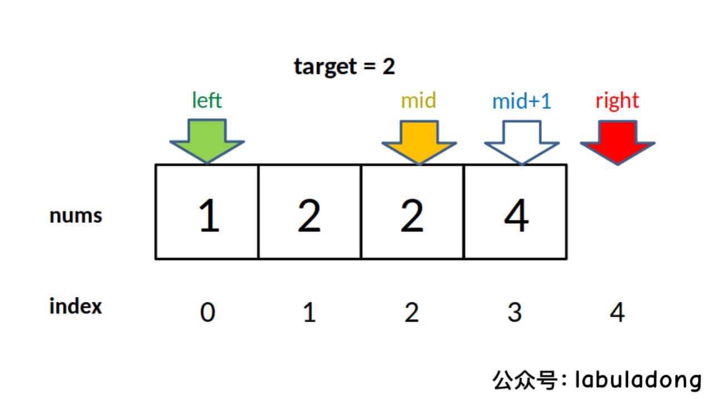

## 二分搜索

> 二分很简单，细节是魔鬼！👍

### 寻找一个数（基本的二分搜索）

二分查找场景：在一个有序数组中寻找一个数、寻找左侧边界、寻找右侧边界。

二分查找算法的大体思路：

- 根据有序数组`nums`的左右边界`[left, right]`计算中间点`mid`
- 如果`nums[mid]==target`，则表明`mid`就是要找的位置
- 如果`nums[mid]<target`，则表明要找的位置在`mid`的右侧，更新边界继续二分查找
- 如果`nums[mid]>target`，则表明要找的位置在`mid`的左侧，更新边界继续二分查找
- 如果出现边界为`l <= r`或者`l < r`的情况（分别对应下面的两种写法），就代表未找到`target`

```C++
// 闭区间[l, r]版本，右边界需要被遍历到！
class Solution {
private:
    int binarySearch(vector<int>& nums, int target, int l, int r) {
        while(l <= r) {
            int mid  = l + (r - l) / 2;
            if(nums[mid] == target) return mid;
            else if(nums[mid] > target) {
                return binarySearch(nums, target, l, mid - 1);
            } else if(nums[mid] < target){
                return binarySearch(nums, target, mid + 1, r);
            }
        }
        return -1;
    }
public:
    int search(vector<int>& nums, int target) {
        return binarySearch(nums, target, 0, nums.size() - 1);
    }
};
// 开区间[l, r)版本，右边界不用被遍历到
class Solution {
private:
    int binarySearch(vector<int>& nums, int target, int l, int r) {
        while(l < r) {
            int mid  = l + (r - l) / 2;
            if(nums[mid] == target) return mid;
            else if(nums[mid] > target) {
                return binarySearch(nums, target, l, mid);
            } else if(nums[mid] < target){
                return binarySearch(nums, target, mid + 1, r);
            }
        }
        return -1;
    }
public:
    int search(vector<int>& nums, int target) {
        return binarySearch(nums, target, 0, nums.size());
    }
};
```

### 寻找左侧边界的二分搜索

找出下图中`target==2`的左侧边界

<p align="center"> </p>

算法的整体思路和寻找一个数是一致的，稍微不同的是：当找到边界值时`nums[mid] == target`，因为要找左边界，所以不能停下来，而是更新右边界后继续查找，直到`while`循环结束。

```c++
int left_bound(int[] nums, int target) {
    int left = 0, right = nums.length - 1;
    // 搜索区间为 [left, right]
    while (left <= right) { // 循环停止的条件是left > right
        int mid = left + (right - left) / 2;
        if (nums[mid] < target) {
            // 搜索区间变为 [mid+1, right]
            left = mid + 1;
        } else if (nums[mid] > target) {
            // 搜索区间变为 [left, mid-1]
            right = mid - 1;
        } else if (nums[mid] == target) {
            // 收缩右侧边界
            right = mid - 1; // 这一步可以合到上面
        }
    }
    // 没找到的情况
    // 如果数组中的数字全部比target小，查找结束时left = nums.length
    // 其他情况下的nums[left] != target
    if (left >= nums.length || nums[left] != target) {
        return -1;
    }
    return left;
}
```

### 寻找右侧边界的二分查找

找出下图中`target==2`的右侧边界

<p align="center"> </p>

与找左边界类似，只不过当`nums[mid] == target`时，要更新左边界继续找，直到循环停止。

```C++
int right_bound(int[] nums, int target) {
    int left = 0, right = nums.length - 1;
    while (left <= right) {
        // 搜索区间为 [left, right]
        int mid = left + (right - left) / 2;
        if (nums[mid] < target) {
            left = mid + 1;
        } else if (nums[mid] > target) {
            right = mid - 1;
        } else if (nums[mid] == target) {
            // 这里改成收缩左侧边界即可
            left = mid + 1;
        }
    }
    // 这里改为检查 right 越界的情况，见下图
    if (right < 0 || nums[right] != target) {
        return -1;
    }
    return right;
}
```

### 总结

上面寻左右边界的代码使用的是闭区间，当然也可以在开区间中寻找。
