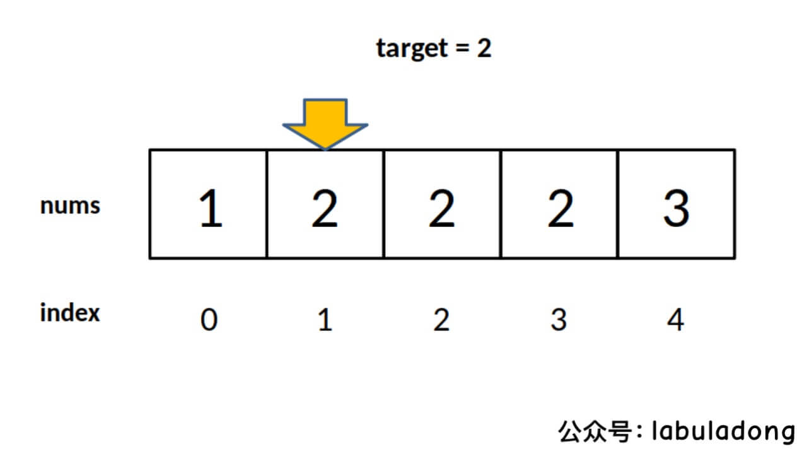

# 搜索

## 寻找一个数（基本的二分搜索）

二分查找场景：在一个有序数组中寻找一个数、寻找左侧边界、寻找右侧边界。

二分查找算法的大体思路：

- 根据有序数组`nums`的左右边界`[left, right]`计算中间点`mid`
- 如果`nums[mid]==target`，则表明`mid`就是要找的位置
- 如果`nums[mid]<target`，则表明要找的位置在`mid`的右侧，更新边界继续二分查找
- 如果`nums[mid]>target`，则表明要找的位置在`mid`的左侧，更新边界继续二分查找
- 如果出现边界为`l <= r`或者`l < r`的情况（分别对应下面的两种写法），就代表未找到`target`

```C++
// 闭区间[l, r]版本，右边界需要被遍历到！
class Solution {
private:
    int binarySearch(vector<int>& nums, int target, int l, int r) {
        while(l <= r) {
            int mid  = l + (r - l) / 2;
            if(nums[mid] == target) return mid;
            else if(nums[mid] > target) {
                return binarySearch(nums, target, l, mid - 1);
            } else if(nums[mid] < target){
                return binarySearch(nums, target, mid + 1, r);
            }
        }
        return -1;
    }
public:
    int search(vector<int>& nums, int target) {
        return binarySearch(nums, target, 0, nums.size() - 1);
    }
};
// 开区间[l, r)版本，右边界不用被遍历到
class Solution {
private:
    int binarySearch(vector<int>& nums, int target, int l, int r) {
        while(l < r) {
            int mid  = l + (r - l) / 2;
            if(nums[mid] == target) return mid;
            else if(nums[mid] > target) {
                return binarySearch(nums, target, l, mid);
            } else if(nums[mid] < target){
                return binarySearch(nums, target, mid + 1, r);
            }
        }
        return -1;
    }
public:
    int search(vector<int>& nums, int target) {
        return binarySearch(nums, target, 0, nums.size());
    }
};
```

## 寻找左侧边界的二分搜索

场景：找出下图中`target==2`的左侧边界

<p align="center"> </p>

