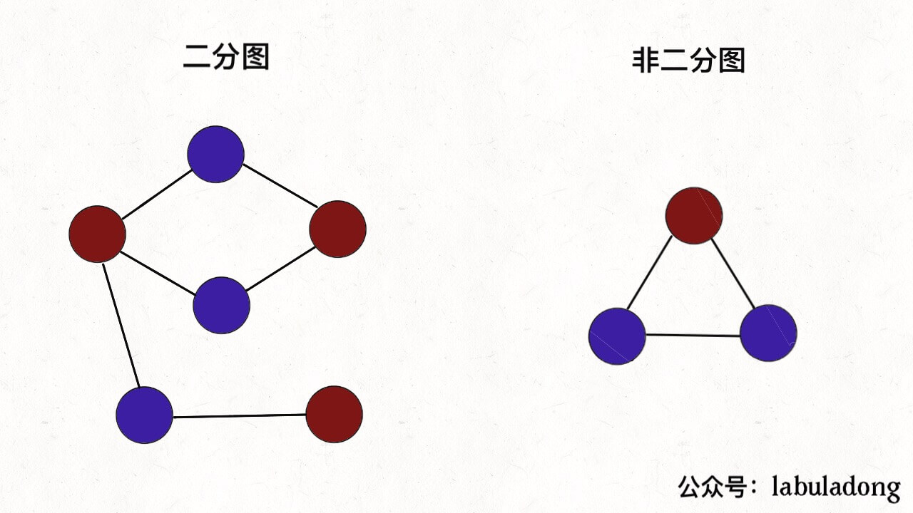

# 二分图

## 定义

二分图的顶点集可分割为两个互不相交的子集，图中每条边依附的两个顶点都分属于这两个子集，且两个子集内的顶点不相邻。如下图：


**形象的比喻：给你一幅「图」，请你用两种颜色将图中的所有顶点着色，且使得任意一条边的两个端点的颜色都不相同，你能做到吗**？

这就是图的「双色问题」，其实这个问题就等同于二分图的判定问题，如果你能够成功地将图染色，那么这幅图就是一幅二分图，反之则不是：



> **双色问题的目的：**
>
> 首先，二分图作为一种特殊的图模型，会被很多高级图算法（比如最大流算法）用到，不过这些高级算法我们不是特别有必要去掌握，有兴趣的读者可以自行搜索。
>
> 从简单实用的角度来看，二分图结构在某些场景可以更高效地存储数据。

## 如何判定一幅图是否是二分图

判定二分图的算法很简单，就是用代码解决「双色问题」。

**说白了就是遍历一遍图，一边遍历一边染色，看看能不能用两种颜色给所有节点染色，且相邻节点的颜色都不相同**。（BFS & DFS）

## 二分图最大匹配（匈牙利算法）

> 渣男算法🤣
>
> 最大匹配意味着成功匹配（成功的匹配不会有公共结点）的数目最大
>
> 匹配的工作是建立在已知二分图的基础上，也就是说已经知道二分图的两个集合

代码实现

题目：

给定一个二分图，其中左半部包含n1个点(编号`1~n1`)，右半部包含n2个点(编号`1~n2`)，二分图共包含m条边。

数据保证任意一条边的两个端点都不可能在同一部分中。

请你求出二分图的最大匹配数。

给定一个二分图G，在G的一个子图M中，M的边集{E}中的任意两条边都不依附于同一个顶点，则称M是一个匹配。

所有匹配中包含边数最多的一组匹配被称为二分图的最大匹配，其边数即为最大匹配数。

**输入格式**

第一行包含3个整数n1、n2和m。

接下来m行，每行包含两个整数u和v，表示左边点集中的点u和右边点集中的点v之间存在一条边。

**输出格式**

输出一个整数，表示二分图的最大匹配数。

```C++
#include <iostream>
#include <algorithm>
using namespace std;

const int N = 510, M = 100010; // 数据范围
int n1, n2, m;
int h[N], e[M], ne[M], idx; // 邻接表
int match[N]; // 右边点配对情况
bool st[N]; // 判重

void add(int a, int b) {
    e[idx] = b, ne[idx] = h[a], h[a] = idx++;
}

bool find(int x) {
    for(int i = h[x]; i != -1; i = ne[i]) {
        int j = e[i];
        if(!st[j]) {
            st[j] = true;
            if(match[j] == 0 || find(match[j])) {
                match[j] = x;
                return true;
            }
        }
	}
    return false;
}

int main(int argc, char* argv[]) {
    scanf("%d%d%d", &n1, &n2, &m);
    memset(h, -1, sizeof h);
    while(m--) {
        int a, b;
        scanf("%d%d", &a, &b);
        add(a, b);
    }
    int res = 0;
    for(int i = 0; i <= n1; i++) {
        memset(st, false, sizeof st);
        if(find(i)) res++;
	}
    printf("%d\n", res);
    return 0;
}
```


