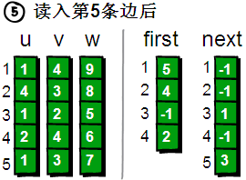
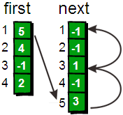

# 图

> labuladong：面试笔试很少出现图相关的问题，就算有，大多也是简单的遍历问题，基本上可以完全照搬多叉树的遍历。适用于树的 DFS/BFS 遍历算法，全部适用于图。

## 图介绍

图是节点集合的一个拓扑结构，节点之间通过边相连。图分为有向图和无向图。

有向图的边具有指向性，即A->B仅表示由A到B的路径，但并不意味着B可以连到A。

与之对应地，无向图的每条边都表示一条双向路径：A-B

### 表示方式

图的数据表示方式也分为两种，即邻接表（adjacency list）和邻接矩阵（adjacency matrix）


邻接表很直观，我把每个节点 `x` 的邻居都存到一个列表里，然后把 `x` 和这个列表关联起来，这样就可以通过一个节点 `x` 找到它的所有相邻节点。

> 邻接表相比邻接矩阵更节省空间，但是时间开销比邻接矩阵大，比如说我想判断节点 `1` 是否和节点 `3` 相邻，我要去邻接表里 `1` 对应的邻居列表里查找 `3` 是否存在。但对于邻接矩阵就简单了，只要看看 `matrix[1][3]` 就知道了，效率高。

邻接矩阵则是一个二维布尔数组（注意，对于无向图它会是一个对称矩阵），我们权且称为 `matrix`，如果节点 `x` 和 `y` 是相连的，那么就把 `matrix[x][y]` 设为 `true`（上图中绿色的方格代表 `true`）。如果想找节点 `x` 的邻居，去扫一圈 `matrix[x][..]` 就行了。

> 在常规的算法题中，邻接表的使用会更频繁一些，主要是因为操作起来较为简单，但这不意味着邻接矩阵应该被轻视。矩阵是一个强有力的数学工具，图的一些隐晦性质可以借助精妙的矩阵运算展现出来。不过本文不准备引入数学内容，所以有兴趣的读者可以自行搜索学习。

**用数组实现邻接表的一种方法**

主要思想：用数组`u[MAXM], v[MAXM], w[MAXM]`将`MAXM`条路径（起点、终点、权值）都存下来，然后维护两个数组`first[MAXN], next[MAXN]`保存顶点之间的路径信息，`first[N]`保存结点`N`的第一条边的编号，`next[first[N]]`保存结点`N`剩余边的编号。

```c++
// 输入4个顶点，5条边
4 5
1 4 9
4 3 8
1 2 5
2 4 6
1 3 7
```

如下是一个有向图邻接表的实现：

first[1]中是5，意味着顶点1的一条边编号是5，对应`uvw`数组中的第5条边；next[5]中是3，意味着顶点1另一条边的编号是3；next[3]中是1，意味着顶点1还有一条边且编号是1；next[1]中是-1，意味着顶点1的边已经全部找到！

注意理解：next[i]存储的是“编号为i的边”的“前一条边”的编号！

<div align="left">
    <br>
    
</div>

代码实现

```c++
const int MAXN, MAXM; // 顶点个数&边数的最大值
int n, m; // 顶点个数、边数、下标
int u[MAXM+1], v[MAXM+1], w[MAXM+1]; // 下标从一开始
int first[MAXN+1], next[MAXN+1]; // 下标从一开始
cin>>n>>m; // 读入顶点个数、边数
// 初始化first数组下标1~n的值为-1，表示1~n顶点暂时都没有边
memset(first, -1, sizeof first);
// 建邻接表
for(int i = 1; i <= m; i++) {
    cin>>u[i]>>v[i]>>w[i]; // 读入每一条边
    // 维护 firs next 数组
    next[i]=first[u[i]];
    first[u[i]]=i;
}

// 遍历每个顶点的各条边 BFS
for(int i = 1; i <= n; i++) {
    cout<<"Node all paths:"<<endl;
    int k = first[i];
    while(k != -1) {
        cout<<u[i]<<v[i]<<w[i]<<endl;
        k = next[k];
	}
}
```

### 顶点的度

在无向图中，「度」就是每个节点相连的边的条数。

由于有向图的边有方向，所以有向图中每个节点「度」被细分为**入度**（indegree）和**出度**（outdegree），比如下图：


其中节点 `3` 的入度为 3（有三条边指向它），出度为 1（它有 1 条边指向别的节点）。

### 图的分类

有向图，无向图，加权图，有向加权图等等……

**其实，这些更复杂的模型都是基于这个最简单的图衍生出来的**。

**有向加权图怎么实现**？

如果是邻接表，我们不仅仅存储某个节点 `x` 的所有邻居节点，还存储 `x` 到每个邻居的权重，不就实现加权有向图了吗？

如果是邻接矩阵，`matrix[x][y]` 不再是布尔值，而是一个 int 值，0 表示没有连接，其他值表示权重，不就变成加权有向图了吗？

