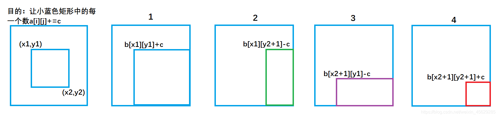

前缀和与差分

**前缀和与差分**技巧适用于快速、频繁地操作一个索引区间内的元素。

**前缀和**是一个存储元素和的数组。当我们要对数组的某个区间 `[i, j]` 求和时：暴力解法的时间复杂度可能是 `O(n)`；但如果从前缀和数组中计算和，则时间复杂度被降为了 `O(1)`

**差分**是前缀和的逆操作（运算）。当我们要对数组的区间 `[i, j]` 修改 `m` 次时：暴力解法的时间复杂度可能是 `O(n*m)`；但是，如果转化为对数组的差分数组的操作，则时间复杂度可以被降为 `O(n)`

### 前缀和

**一维数组前缀和**：力扣第 303 题「 [区域和检索 - 数组不可变](https://leetcode-cn.com/problems/range-sum-query-immutable/)」，计算数组区间内元素的和，这是一道标准的前缀和问题。

```C++
class NumArray {
private:
    vector<int> perSum; // 前缀和数组
public:
    NumArray(vector<int>& nums) {
        int n = nums.size();
        perSum.resize(n+1); // 初始化前缀和数组
        for(int i = 1; i <= n; i++) {
            perSum[i] = perSum[i-1] + nums[i-1]; // perSum[i]代表i元素前和
        }
    }
    int sumRange(int left, int right) {
        return perSum[right+1] - perSum[left]; // 注意index
    }
};
```

**二维矩阵前缀和**：力扣第 304 题「 [304. 二维区域和检索 - 矩阵不可变](https://leetcode-cn.com/problems/range-sum-query-2d-immutable/)」，其实和上一题类似，上一题是让你计算**子数组**的元素之和，这道题让你计算**二维矩阵中子矩阵**的元素之和。如下图中的红色矩阵`(r1, c1)->(r2, c2)`。

<div align="center"></div>

如果使用两层 `for` 循环的话，时间复杂度可能会是 `O(n^2)`级别，如果进行 `m` 次操作，时间复杂度可能会达到 `O(m*n^2)`；使用前缀和数组，时间复杂度只是初始化时的 `O(n^2)`

如果我们定义二维前缀和数组 `numSum[i][j]` 代表 `[0][0]` 到 `[i][j]` 这个矩形区间的和，那么，`(r1, c1)` 到 `(r2, c2)` 这个矩形的和为：`numSum[r1][c1]-numSum[r1-1][c2]-numSum[r2][c1-1]+numSum[r1-1][c1-1]` ，对应到上图就是：计算**红色**的这个子矩阵的元素之和，可以用**绿色矩阵**减去**蓝色矩阵**减去**橙色矩阵**最后加上**粉色矩阵**

```C++
class NumMatrix {
private:
    vector<vector<int>> numSum;
public:
    NumMatrix(vector<vector<int>>& matrix) {
        int row = matrix.size();
        int column = matrix[0].size();
        numSum.resize(row+1, vector<int>(column+1));  // 注意大小
        for(int i = 1; i <= row; i++) {
            for(int j = 1; j <= column; j++) {
                numSum[i][j] = numSum[i][j-1] + numSum[i-1][j] - numSum[i-1][j-1] + matrix[i-1][j-1];
            }
        }
    }
    
    int sumRegion(int row1, int col1, int row2, int col2) {
        return numSum[row2+1][col2+1] - numSum[row1][col2+1] - numSum[row2+1][col1] + numSum[row1][col1]; // 注意坐标的变换
        //先在matrix找到再变换到numSum中
    }
};
```

**和为 k 的子数组**：最后聊一道稍微有些困难的前缀和题目，力扣第 560 题「 [和为 K 的子数组](https://leetcode-cn.com/problems/subarray-sum-equals-k/)」，如下：

> 给你一个整数数组 `nums` 和一个整数 `k` ，请你统计并返回该数组中和为 `k` 的子数组的个数 。

**前缀和 + 哈希表优化**

构造数组 `nums` 的前缀和数组 `numSum` ， 当计算到 `numSum[i]`  时，考虑 `numSum[i]` 之前的元素 `numSum[j]` 是否等于 `numSum[i]-k`，如果存在，则说明 `j, i` 之间的元素之和就是 `k`，这样便得到了一个子数组。如果用哈希表存储`numSum`，当遍历完整个数组`nums`时，便得到了符合要求的子数组的个数

```C++
class Solution {
public:
    int subarraySum(vector<int>& nums, int k) {
        unordered_map<int, int> hashMap; // 哈希表存储<numSum值, 个数>
        hashMap[0] = 1;  // 这个很重要！一定要加一个sum_i=0的情况！
        /* 
        为什么要初始化一个hashMap[0]=1的情况：
        hashMap[0]代表和为零时的情况，初始化的时候这种情况只会有一种，那就是啥也不加
        因为sum_i-sum_j代表的是i（包括）到j之间的元素，
        如果没有hashMap[0]，则无法计算从0到i所有元素的和，只能计算出从1到i所有元素的和
        */
        int res = 0;
        int n = nums.size();
        int sum_i = 0, sum_j = 0;

        for(int i = 0; i < n; i++) {
            sum_i += nums[i];
            sum_j = sum_i - k;
            if(hashMap.count(sum_j) != 0)  // 大坑！count返回0或1，而不是个数
                res += hashMap[sum_j];
            hashMap[sum_i]++;
        }
        return res;
    }
};
```

### 差分

**一维差分**

给定一个原数组`a`：`a[1], a[2], a[3],,,,,, a[n];`，然后构造一个数组`b` ： `b[1] ,b[2] , b[3],,,,,, b[i];`，使得 `a[i] = b[1] + b[2 ]+ b[3] +,,,,,, + b[i]`。也就是说，`a`数组是`b`数组的前缀和数组，反过来我们把`b`数组叫做`a`数组的**差分数组**。**一维差分结论**：

给`a`数组中的`[l, r]`区间中的每一个数都加上`c`，只需对差分数组`b`做 `b[l] += c`, `b[r+1] -= c`。时间复杂度为`O(1)`, 大大提高了效率。🎉

考虑这样一个问题：对数组`nums`的区间 `[l, r]` 修改 `m` 次（每次都为这个区间的元素加上一个数`c`），暴力做法便是：`for`循环`l`到`r`区间，并执行`m`次这样的操作，时间复杂度就是 `O(n*m)`。但是如果把问题变为：对数组`nums`的差分数组的操作，时间复杂度将会变为 `O(m+n)`。

```C++
//差分 时间复杂度 o(m)
#include<iostream>
using namespace std;
const int N=1e5+10;
int a[N],b[N]; 
int main()
{
    int n,m;
    scanf("%d%d",&n,&m); // 输入a的长度，操作次数
    for(int i=1;i<=n;i++) 
    {
        scanf("%d",&a[i]);
        b[i]=a[i]-a[i-1];      //构建差分数组
    }
    int l,r,c;
    while(m--)
    {
        scanf("%d%d%d",&l,&r,&c);
        b[l]+=c;     //表示将序列中[l, r]之间的每个数加上c
        b[r+1]-=c;
    }
    for(int i=1;i<=n;i++) 
    {
        b[i]+=b[i-1];  //求前缀和运算
        printf("%d ",b[i]);
    }
    return 0;
}
```

**二维差分**

类比于一维差分，二维差分同样可以快速地实现如下操作：

将原数组`a[][]`中从`(r1, c1)`到`(r2, c2)`的矩形区域里的每个数都加上`c`。

图形如下：

<div align="center">
    
    
</div>

`b[x1][y1]+=c;` 对应图1，让整个a数组中蓝色矩形面积的元素都加上了c。
`b[x1][y2+1]-=c ;` 对应图2，让整个a数组中绿色矩形面积的元素再减去c，使其内元素不发生改变。
`b[x2+1][y1]-=c ;` 对应图3，让整个a数组中紫色矩形面积的元素再减去c，使其内元素不发生改变。
`b[x2+1][y2+1]+=c;` 对应图4，让整个a数组中红色矩形面积的元素再加上c，红色内的相当于被减了两次，再加上一次c，才能使其恢复。

```C++
// 给以(x1, y1)为左上角，(x2, y2)为右下角的子矩阵中的所有元素加上c
void add(int x1, int y1, int x2, int y2, int c)
{
    b[x1][y1] += c;
    b[x2 + 1][y1] -= c;
    b[x1][y2 + 1] -= c;
    b[x2 + 1][y2 + 1] += c;
}
```

**差分初始化**

考虑使用下面的`add`函数对差分数组`b`进行操作

```cpp
void add(int L, int R, int x)
{
    b[L] += x;
    b[R + 1] -= x;
}
```

对于差分数组`b`的初始化也可以使用该函数完成：一开始可以把原数组`a`想象成全是`0`，即`a[]={0}`，此时相应的差分数组也全是`0`， 即`b[]={0}`，接下来，对原数组`a`的初始值可以作如下考虑：

- `a[1]`相当于区间`[1, 1]`的每个数都加上`a[1]`
- `a[2]`相当于区间`[2, 2]`的每个数都加上`a[2]`
- `a[3]`相当于区间`[3, 3]`的每个数都加上`a[3]`
- ......

- `a[n]`相当于区间`[n, n]`的每个数都加上`a[n]`

这样，用上面`add`函数即可完成`b`的初始化。

### Reference

- https://labuladong.github.io/algo/2/18/21/

- https://zhuanlan.zhihu.com/p/268883850 ——如何构造`b`数组

- https://blog.csdn.net/weixin_45629285/article/details/111146240

