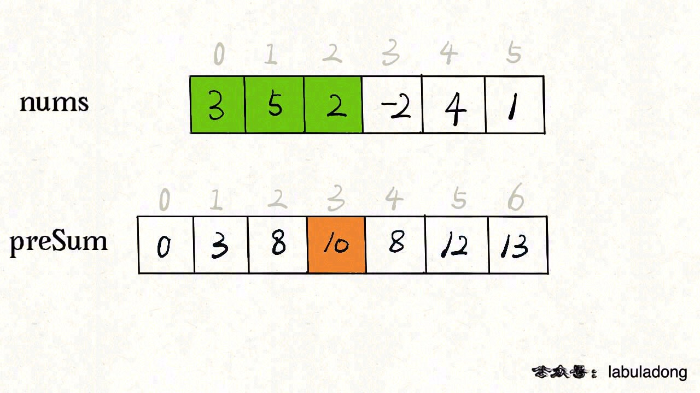
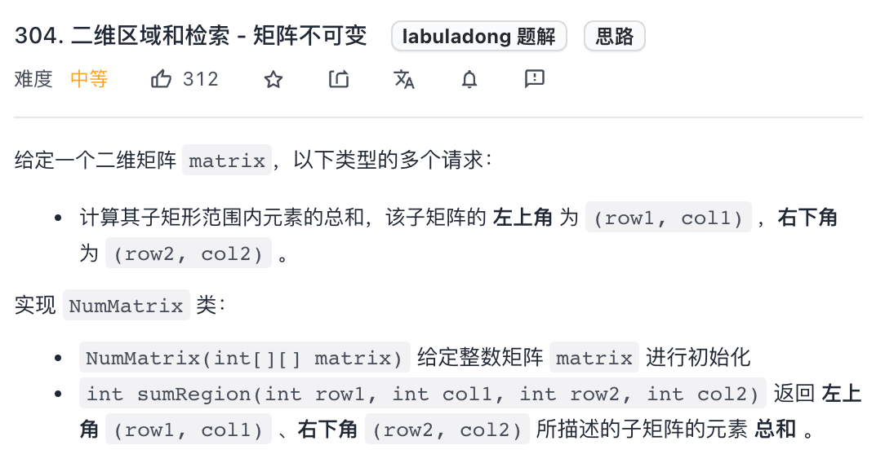

## 前缀和数组

**前缀和**技巧适用于快速、频繁地计算一个索引区间内的元素之和。

### 一维数组中的前缀和

力扣第 303 题「 [区域和检索 - 数组不可变](https://leetcode-cn.com/problems/range-sum-query-immutable/)」，计算数组区间内元素的和，这是一道标准的前缀和问题。

一般思路计算数组区间的元素和：

```c++
int sum = 0;
for(int i = left; i <= right; i++) {
    sum += nums[i]
}
return sum;
```

这样，可以达到效果，但是效率很差，因为 `sumRange` 方法会被频繁调用，而它的时间复杂度是 `O(N)`，其中 `N` 代表 `nums` 数组的长度。

可以使用空间换时间的思想，核心思路是我们 new 一个新的数组 `preSum` 出来，`preSum[i]` 记录 `nums[0..i-1]` 的累加和，看图 10 = 3 + 5 + 2：

<div align="center"></div>

看这个 `preSum` 数组，如果我想求索引区间 `[1, 4]` 内的所有元素之和，就可以通过 `preSum[5] - preSum[1]` 得出。这样，`sumRange` 函数仅仅需要做一次减法运算，避免了每次进行 for 循环调用，最坏时间复杂度为常数 `O(1)`。

### 二维矩阵中的前缀和

这是力扣第 304 题「 [304. 二维区域和检索 - 矩阵不可变](https://leetcode-cn.com/problems/range-sum-query-2d-immutable/)」，其实和上一题类似，上一题是让你计算子数组的元素之和，这道题让你计算二维矩阵中子矩阵的元素之和：

<div align="center"></div>

比如说输入的 `matrix` 如下图：

<div align="center"></div>

如果用一个嵌套 for 循环去遍历这个红色矩阵，但这样的话 `sumRegion` 函数的时间复杂度就高了，算法的格局就低了。

如果我想计算红色的这个子矩阵的元素之和，可以用绿色矩阵减去蓝色矩阵减去橙色矩阵最后加上粉色矩阵，而绿蓝橙粉这四个矩阵有一个共同的特点，就是左上角就是 `(0, 0)` 原点。

那么我们可以维护一个二维 `preSum` 数组，专门记录以原点为顶点的矩阵的元素之和，就可以用几次加减运算算出任何一个子矩阵的元素和：

```java
class NumMatrix {
    // 定义：preSum[i][j] 记录 matrix 中子矩阵 [0, 0, i-1, j-1] 的元素和
    private int[][] preSum;
    public NumMatrix(int[][] matrix) {
        int m = matrix.length, n = matrix[0].length;
        if (m == 0 || n == 0) return;
        // 构造前缀和矩阵
        preSum = new int[m + 1][n + 1];
        for (int i = 1; i <= m; i++) {
            for (int j = 1; j <= n; j++) {
                // 计算每个矩阵 [0, 0, i, j] 的元素和
                preSum[i][j] = preSum[i-1][j] + preSum[i][j-1] + matrix[i - 1][j - 1] - preSum[i-1][j-1];
            }
        }
    }
    // 计算子矩阵 [x1, y1, x2, y2] 的元素和
    public int sumRegion(int x1, int y1, int x2, int y2) {
        // 目标矩阵之和由四个相邻矩阵运算获得
        return preSum[x2+1][y2+1] - preSum[x1][y2+1] - preSum[x2+1][y1] + preSum[x1][y1];
    }
}
```

这样，`sumRegion` 函数的时间复杂度也用前缀和技巧优化到了 O(1)，这是典型的「空间换时间」思路。

### 和为 k 的子数组

最后聊一道稍微有些困难的前缀和题目，力扣第 560 题「 [和为 K 的子数组](https://leetcode-cn.com/problems/subarray-sum-equals-k/)」：

> 给你一个整数数组 `nums` 和一个整数 `k` ，请你统计并返回 *该数组中和为 `k` 的子数组的个数* 。


**前缀和 + 哈希表优化**

```
class Solution {
public:
    int subarraySum(vector<int>& nums, int k) {
        unordered_map<int, int> hashMap;
        hashMap[0] = 1;  // 这个很重要！一定要加一个sum_i=0的情况！
        int res = 0;
        int n = nums.size();
        int sum_i = 0, sum_j = 0;

        for(int i = 0; i < n; i++) {
            sum_i += nums[i];
            sum_j = sum_i - k;
            if(hashMap.count(sum_j) != 0)  // 大坑！count返回0或1，而不是个数
                res += hashMap[sum_j];
            hashMap[sum_i]++;
        }
        return res;
    }
};
```

### Reference

- https://labuladong.github.io/algo/2/18/21/

