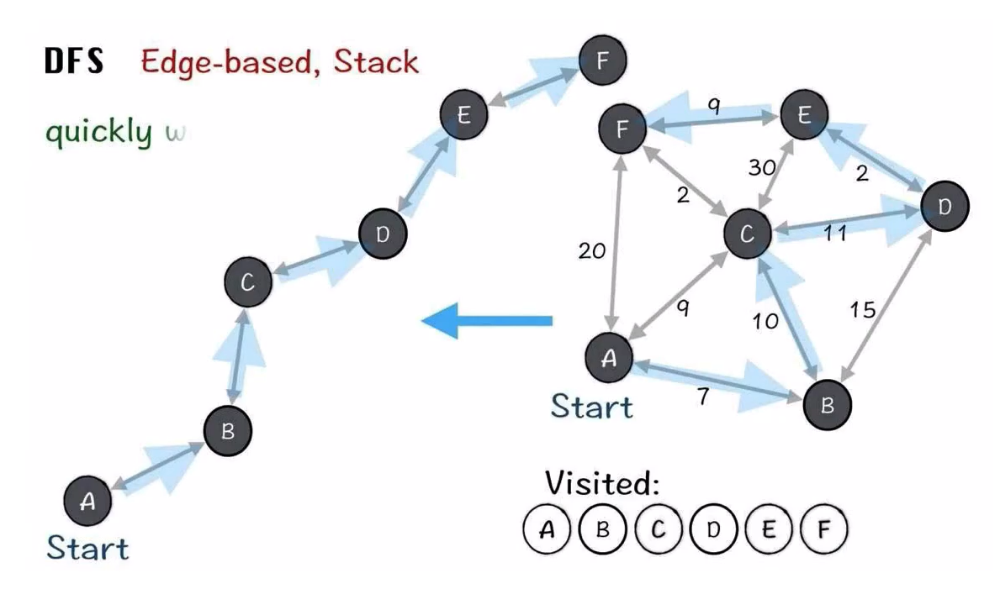
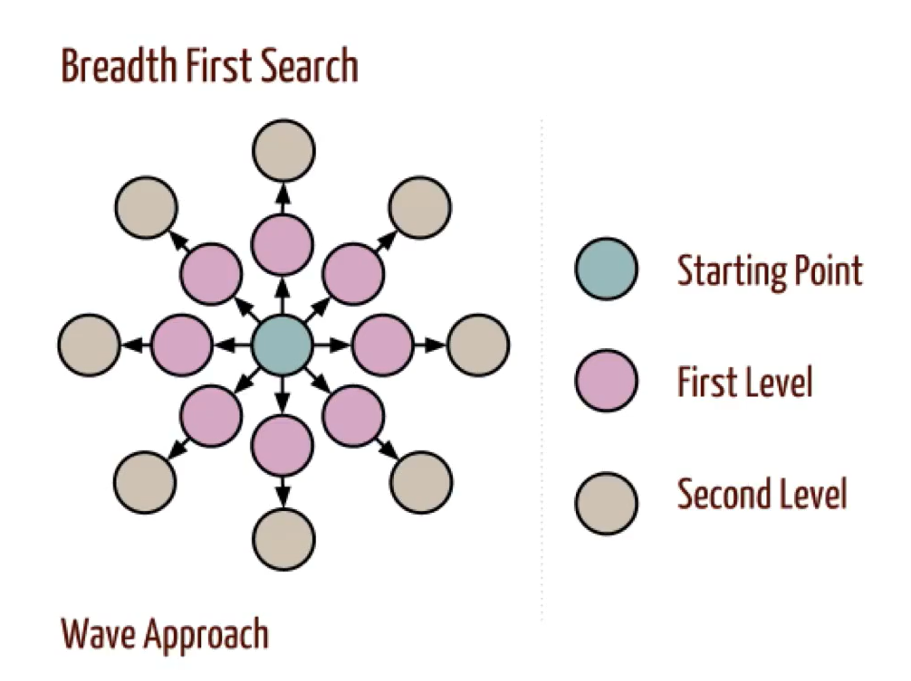

## 图的遍历

### 深度优先（DFS）



多叉树（图和多叉树非常类似，不同在于图是带环的，而多叉树没环）的遍历框架如下：

```java
/* 多叉树遍历框架 */
void traverse(TreeNode root) {
    // 递归停止
    if (root == null) return;
    // 遍历所有子树并递归
    for (TreeNode child : root.children) {
        traverse(child);
    }
}
```

图和多叉树最大的区别是，图是可能包含环的，你从图的某一个节点开始遍历，有可能走了一圈又回到这个节点。

所以，如果图包含环，遍历框架就要一个 `visited` 数组进行辅助：

```java
// 记录被遍历过的节点
boolean[] visited;
// 记录从起点到当前节点的路径
boolean[] onPath;

/* 图遍历框架 */
void traverse(Graph graph, int s) {
    if (visited[s]) return;
    // 经过节点 s，标记为已遍历
    visited[s] = true;
    // 做选择：标记节点 s 在路径上
    onPath[s] = true;
    for (int neighbor : graph.neighbors(s)) {
        traverse(graph, neighbor);
    }
    // 撤销选择：节点 s 离开路径
    onPath[s] = false;
}
```

关于 `visited` 数组和 `onPath` 数组的区别，labuladong的[文章](https://labuladong.github.io/algo/2/20/36/)讲的很好

 `visited` 数组中的值代表顶点**是否被访问到过**

 `onPath` 数组代表着从**出发结点**到**当前结点**的路径（之间的结点以及他们自己）

如果让你处理路径相关的问题，这个 `onPath` 变量是肯定会被用到的，比如拓扑排序中就有运用。

### 广度优先（BFS）

按照层次向下遍历：遍历当前层，并把该层结点的子结点推入队列，依次访问队列中的元素

（配合队列实现）



#### 代码框架

```c++
queue<int> qNode;
for(int node = 0; node < numNode; node++) {
    // 剪枝
    if(visited[node]) continue;
    // 访问
    visited[node] = true;
    qNode.push(node);
    while(!qNode.empty() && isBi) {
        // 取出本结点
        int curNode = qNode.front();
        qNode.pop();
        // 访问子结点
        for(int sonNode : graph[curNode]) {
            if(!visited[sonNode]) {
                visited[sonNode] = true;
                qNode.push(sonNode);
            }
        }
    }
}
```

#### BFS特点

搜索所有可以到达的状态，转移顺序为『初始状态->只需一次转移就可到达的所有状态->只需两次转移就可到达的所有状态->...』，所以对于同—个状态，BFS只搜索一次

BFS通常配合队列一起使用，搜索时先将状态加入到队列中，然后从队列顶端不断取出状态，同时把可从该状态转移到并且尚未访问过的状态加入队列，直到队列为空或已找到解。因此BFS适合用于『由近及远』的搜索，比较适合用于求解最短路径、最少操作之类的问题。

