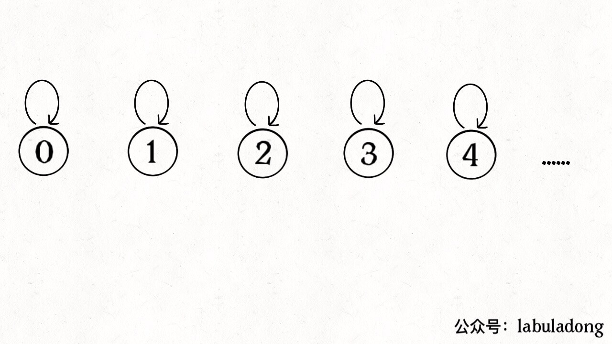
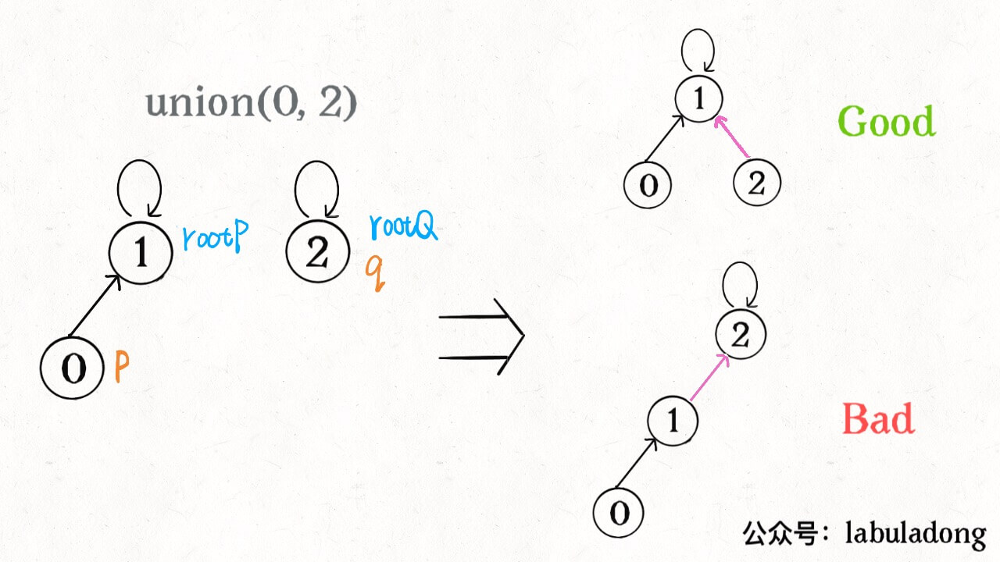
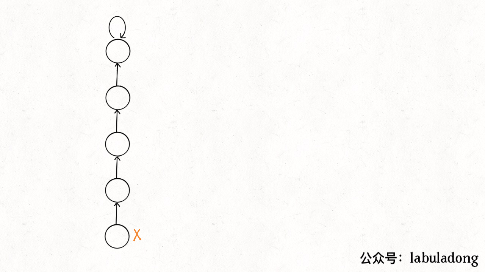

# 并查集（UNION FIND）

## 动态连通性

> 连通性具有以下性质：
>
> 1、自反性：节点 `p` 和 `p` 是连通的。
>
> 2、对称性：如果节点 `p` 和 `q` 连通，那么 `q` 和 `p` 也连通。
>
> 3、传递性：如果节点 `p` 和 `q` 连通，`q` 和 `r` 连通，那么 `p` 和 `r` 也连通。

下图中的结点中，`012`是相互连通的，其他结点个不相通。


## 基本思路

使用森林（若干棵树）来表示图的动态连通性，用数组来具体实现这个森林。

怎么用森林来表示连通性呢？我们设定**树的每个节点有一个指针指向其父节点**，如果是根节点的话，这个指针指向自己。

比如说刚才那幅 10 个节点的图，**一开始的时候没有相互连通，就是这样：**



这时，数组表示是：`root[i] = i`，即，每个结点的根节点都是自己。

**如果某两个节点被连通，则让其中的（任意）一个节点的根节点接到另一个节点的根节点上**：


这时，在`union(1, 5)`之前数组是：`root[0, 1, 6, 3]=0, root[5]=2`，之后是：`root[0, 1, 6, 3]=2, root[5]=2`，**这样，如果节点 `p` 和 `q` 连通的话，它们一定拥有相同的根节点。**

**从上面的过程中可以看出，这个过程主要分成两步：**

- 找到两个结点的根结点
- 将一个根结点合并到另一个根结点上

## 平衡性优化

可以想象，如果只是简单粗暴的把 `p` 所在的树接到 `q` 所在的树的根节点下面，那么这里就可能出现「头重脚轻」的不平衡状况，比如下面这种局面：



**我们其实是希望，小一些的树接到大一些的树下面，这样就能避免头重脚轻，更平衡一些**。

其中一种解决方法是额外使用一个 `size` 数组，记录每棵树包含的节点数，我们不妨称为「重量」，在进行合并时，选择把`size`小的树合并到`size`大的树上。

## 路径压缩

能不能进一步压缩每棵树的高度，使树高始终保持为常数？

这样 `find` 就能以 O(1) 的时间找到某一节点的根节点，相应的，`connected` 和 `union` 复杂度都下降为 O(1)。

要做到这一点，非常简单，只需要在 `find` 中加一行代码：

```Java
private int find(int x) {
    while (parent[x] != x) {
        // 进行路径压缩
        parent[x] = parent[parent[x]];
        x = parent[x];
    }
    return x;
}
```

`find`过程如下：



以上就是 Union-Find 算法的核心逻辑，总结一下优化算法的过程：

1、用 `parent` 数组记录每个节点的父节点，相当于指向父节点的指针，所以 `parent` 数组内实际存储着一个森林（若干棵多叉树）。

2、用 `size` 数组记录着每棵树的重量，目的是让 `union` 后树依然拥有平衡性，保证各个 API 时间复杂度为 O(logN)，而不会退化成链表影响操作效率。

3、在 `find` 函数中进行路径压缩，保证任意树的高度保持在常数，使得各个 API 时间复杂度为 O(1)。使用了路径压缩之后，可以不使用 `size` 数组的平衡优化。

## 模板代码

```c++
// 并查集模板代码
#include <vector>
#include <numeric>

class UF {
private:
    int num_node = 0; // 连通分量的个数
    std::vector<int> size; // 存放以i为根的树的大小
    std::vector<int> fa; // 核心数据结构，存放根节点

public:
    UF(int n) : num_node(n), size(n), fa(n) { // 构造函数
        std::iota(fa.begin(), fa.end(), 0);
        std::fill(size.begin(), size.end(), 1);
    }
    int find(int x) { // 找根结点函数
        return fa[x] == x ? fa[x] : fa[x] = find(fa[x]);
    }
    bool isConnected(int p, int q) { // 返回是否连通
        int rootP = find(p);
        int rootQ = find(q);
        return rootP == rootQ;
    }
    void merge(int from, int to) { // 两个连通分量合并成一个连通分量
        from = find(from);
        to = find(to);
        if (from != to) {
            fa[from] = to;
            size[to] += size[from];
        }
        num_node--;
    }
    int sizeOfRoot(int root) { // 返回树的大小
        return size[root];
    }
    int count() const { // 返回连通分量个数
        return num_node;
    }
};
```

