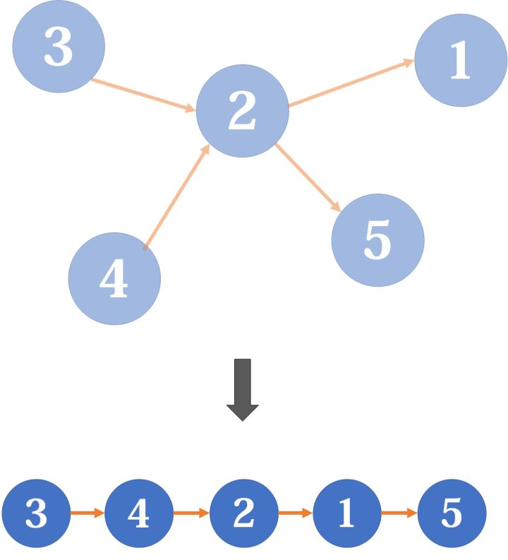
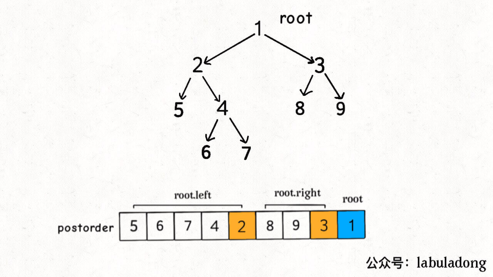

# 拓扑排序

## 有向图的环检测

> 有向无环图（Directed Acyclic Graph，DAG）
> 
> 经典问题：[课程表](https://leetcode-cn.com/problems/course-schedule/)，当存在循环依赖的时候，就无法修完所有课程。
> 
> 其实这种场景在现实生活中也十分常见，比如我们写代码 import 包也是一个例子，必须合理设计代码目录结构，否则会出现循环依赖，编译器会报错，所以编译器实际上也使用了类似算法来判断你的代码是否能够成功编译。
> 
> **看到依赖问题，首先想到的就是把问题转化成「有向图」这种数据结构，只要图中存在环，那就说明存在循环依赖**。
> 
> **针对课程表这个问题：**
> 
> 首先可以把课程看成「有向图」中的节点，节点编号分别是 `0, 1, ..., numCourses-1`，把课程之间的依赖关系看做节点之间的有向边。比如说必须修完课程 `1` 才能去修课程 `3`，那么就有一条有向边从节点 `1` 指向 `3`。所以我们可以根据题目输入的 `prerequisites` 数组生成一幅有向图。
> 
> **如果发现这幅有向图中存在环，那就说明课程之间存在循环依赖，肯定没办法全部上完；反之，如果没有环，那么肯定能上完全部课程**。

### DFS判断是否含环

- 根据依赖关系建立有向图

- 用一个 for 循环将所有节点都作为起点调用一次 DFS 搜索算法

- 使用一个 `visited` 数组表示当前结点是否已经遍历过，如果已经遍历过没必要再遍历一遍（剪枝）

- 添加一个布尔数组 `onPath` 记录当前 `traverse` 经过的路径

- 在进入节点 `s` 的时候将 `onPath[s]` 标记为 true，离开时标记回 false，如果发现 `onPath[s]` 已经被标记，说明出现了环。

## 拓扑排序

直观地说就是，让你把一幅图「拉平」，而且这个「拉平」的图里面，所有箭头方向都是一致的，比如上图所有箭头都是朝右的。

很显然，如果一幅有向图中存在环，是无法进行拓扑排序的，因为肯定做不到所有箭头方向一致；反过来，如果一幅图是「有向无环图」，那么一定可以进行拓扑排序。

### DFS

其实特别简单，将图后序遍历的结果进行反转，就是拓扑排序的结果。

> 对于图而言，只有前序和后序两种遍历。前序：先访问该结点，再遍历访问所有子结点；后序：先遍历访问所有子结点，再访问该结点
> 
> 网上也有拓扑排序算法不用对后序遍历结果进行反转的，原因是建图时候对边的定义不同。labuladong的方法：比如节点 `1` 指向 `2`，含义是节点 `1` 被节点 `2` 依赖，即做完 `1` 才能去做 `2`；如果反过来，把有向边定义为「依赖」关系，那么整幅图中边全部反转，就可以不对后序遍历结果反转。**不过呢，现实中一般都是从初级任务指向进阶任务，所以像labuladong这样把边定义为「被依赖」关系可能比较符合我们的认知习惯**。

后序遍历的这一特点很重要，之所以拓扑排序的基础是后序遍历，是因为一个任务必须等到它依赖的所有任务都完成之后才能开始开始执行。

**借助二叉树理解：**

子结点依赖父结点，所以，拓扑排序应该是：1->3->9->8->2......，正好是后序遍历结果的逆序。

### Kahn算法（BFS）

> 大体思路
> 
> - 先拿出所有入度为0的点排在前面，并在原图中将它们删除，同时删除以这些结点为起点的边；
> - 这时有些点的入度减少了，于是再拿出当前所有入度为0的点放在已经排序的序列后面，然后删除这些结点和对应的边；
> - 因为是有向无环图，而且删除操作不会产生环，所以每时每刻都一定存在入度为0的点，一定可以不断进行下去，直到所有点被删除。

**Kahn算法——判断是否含环**

- 构建邻接表，和之前一样，边的方向表示「被依赖」关系。
- 构建一个 `indegree` 数组记录每个节点的入度，即 `indegree[i]` 记录节点 `i` 的入度。
- 对 BFS 队列进行初始化，将入度为 0 的节点首先装入队列。
- **开始执行 BFS 循环，不断弹出队列中的节点，减少相邻节点的入度，并将入度变为 0 的节点加入队列**。
- **如果最终所有节点都被遍历过（`count` 等于节点数），则说明不存在环，反之（`count` 小于节点数）则说明存在环**。

**Kahn算法——拓扑排序**

看过上面的算法后，BFS的拓扑排序就很简单了：节点的遍历顺序就是拓扑排序的结果，只需要用一个数组存一下结点即可。

### 总结

按道理， 图的遍历都需要 `visited` 数组防止走回头路，这里的 BFS 算法其实是通过 `indegree` 数组实现的 `visited` 数组的作用，只有入度为 `0` 的节点才能入队，从而保证不会出现死循环。

思考题：对于 BFS 和 DFS 的环检测算法，如果问你形成环的节点具体是哪些，你应该如何实现呢？
