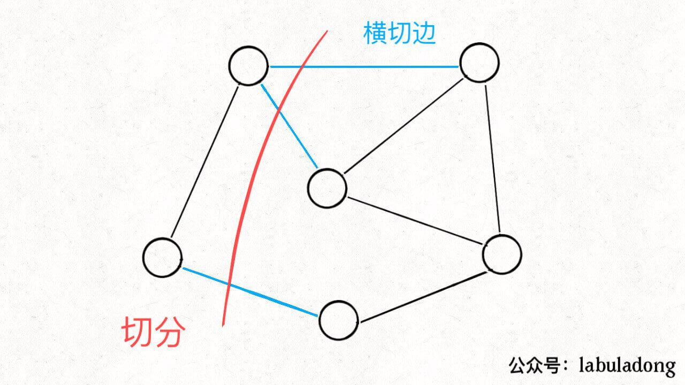
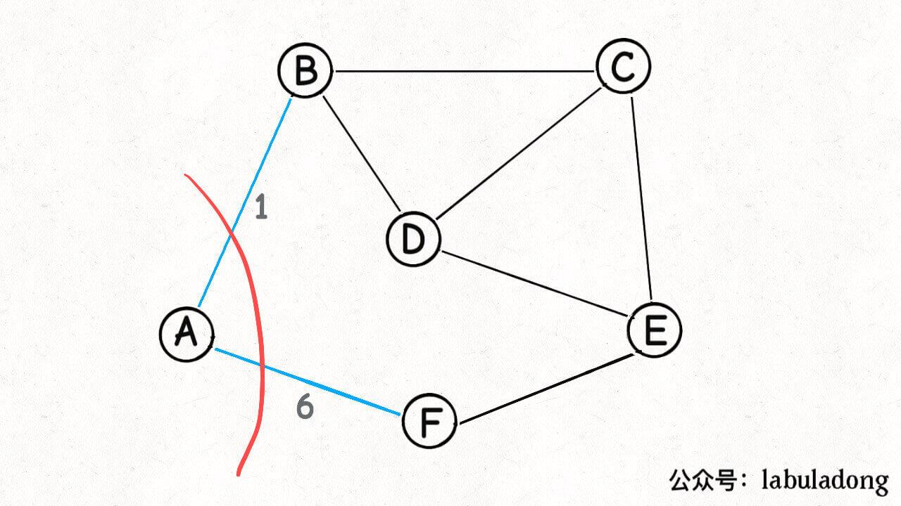
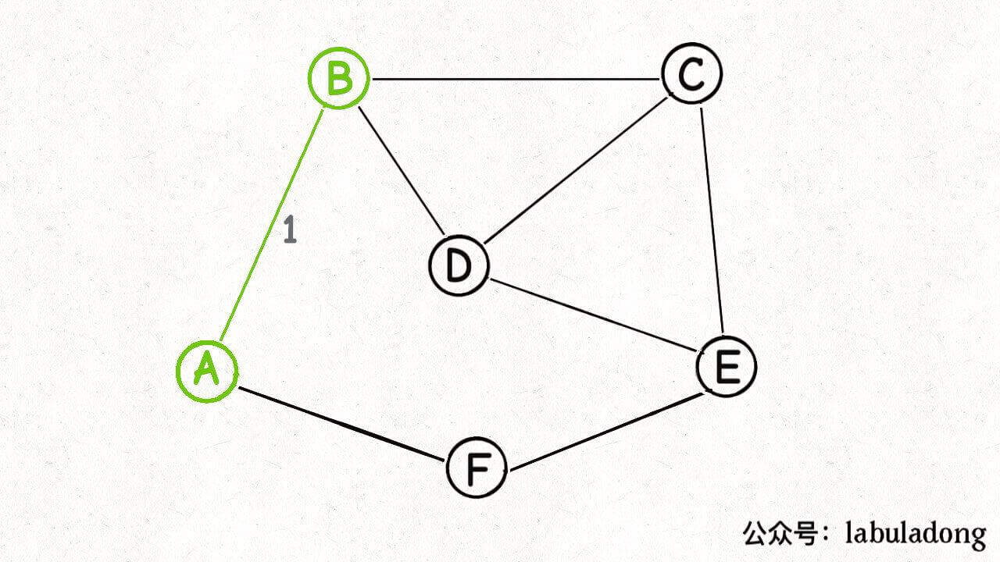
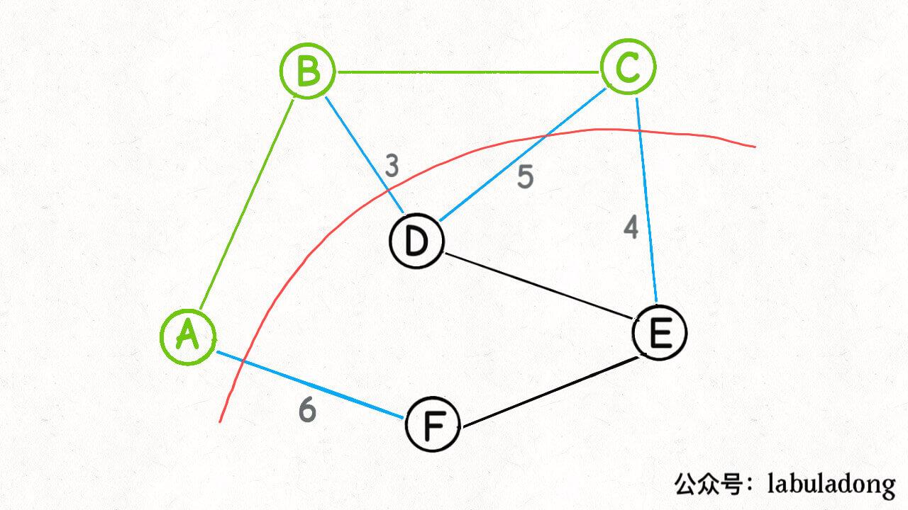
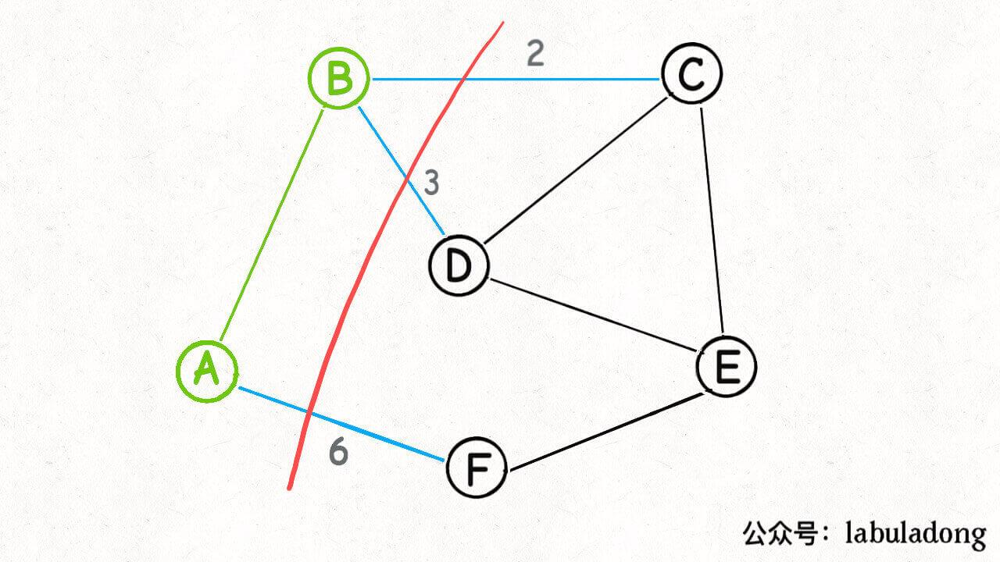
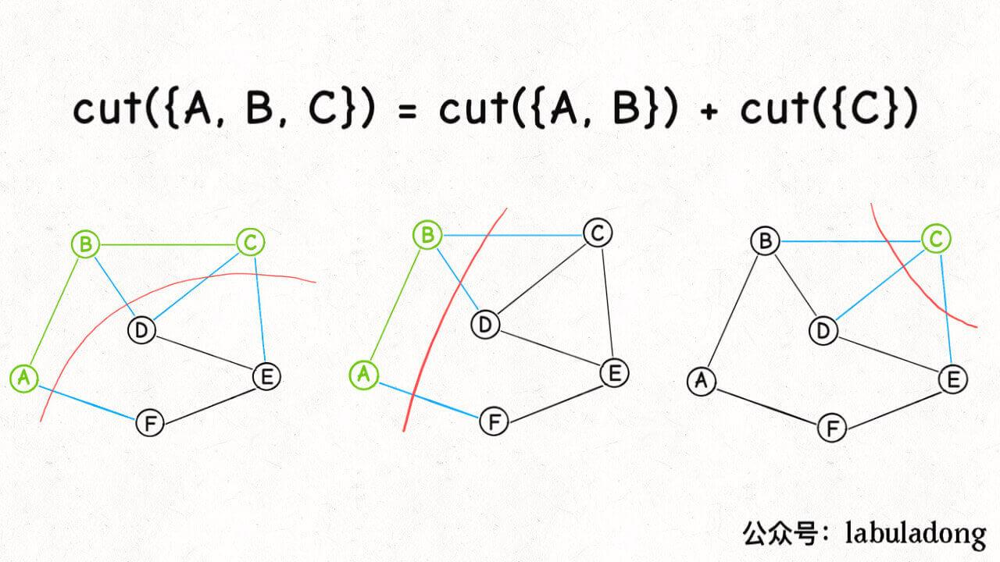

# 最小生成树

最小生成树算法主要有 Prim 算法（普里姆算法）和 Kruskal 算法（克鲁斯卡尔算法）两种，这两种算法虽然都运用了贪心思想，但从实现上来说差异还是蛮大的。

## 什么是最小生成树

**先说「树」和「图」的根本区别：树不会包含环，图可以包含环**。

如果一幅图没有环，完全可以拉伸成一棵树的模样。说的专业一点，树就是「无环连通图」。

那么什么是图的「生成树」呢，其实按字面意思也好理解，就是在图中找一棵包含图中的所有节点的树。专业点说，生成树是含有图中所有顶点的「无环连通子图」。

容易想到，一幅图可以有很多不同的生成树，比如下面这幅图，红色的边就组成了两棵不同的生成树：


对于加权图，每条边都有权重，所以每棵生成树都有一个权重和。比如上图，右侧生成树的权重和显然比左侧生成树的权重和要小。

**那么最小生成树很好理解了，所有可能的生成树中，权重和最小的那棵生成树就叫「最小生成树」**。

> PS：一般来说，我们都是在**无向加权图**中计算最小生成树的，所以使用最小生成树算法的现实场景中，图的边权重一般代表成本、距离这样的标量。

## Kruskal 最小生成树算法

所谓最小生成树，就是图中若干边的集合（我们后文称这个集合为 `mst`，最小生成树的英文缩写），你要保证这些边：

1、包含图中的所有节点。

2、形成的结构是树结构（即不存在环）。

3、权重和最小。

有之前题目的铺垫，前两条其实可以很容易地利用 Union-Find 算法做到，关键在于第 3 点，如何保证得到的这棵生成树是权重和最小的，这里就用到了贪心思路：

**将所有边按照权重从小到大排序，从权重最小的边开始遍历，如果这条边和`mst`中的其它边不会形成环，则这条边是最小生成树的一部分，将它加入`mst`集合；否则，这条边不是最小生成树的一部分，不要把它加入`mst`集合**。

这样，最后`mst`集合中的边就形成了最小生成树。

### 最后说下 Kruskal 算法的复杂度分析：

假设一幅图的节点个数为`V`，边的条数为`E`，首先需要`O(E)`的空间装所有边，而且 Union-Find 算法也需要`O(V)`的空间，所以 Kruskal 算法总的空间复杂度就是`O(V + E)`。

时间复杂度主要耗费在排序，需要`O(ElogE)`的时间，Union-Find 算法所有操作的复杂度都是`O(1)`，套一个 for 循环也不过是`O(E)`，所以总的时间复杂度为`O(ElogE)`。

## Prim 最小生成树算法

### 对比 Kruskal 算法

图论的最小生成树问题，就是让你从图中找若干边形成一个边的集合 `mst`，这些边有以下特性：

1、这些边组成的是一棵树（树和图的区别在于不能包含环）。

2、这些边形成的树要包含所有节点。

3、这些边的权重之和要尽可能小。

那么 Kruskal 算法是使用什么逻辑满足上述条件，计算最小生成树的呢？

**首先，Kruskal 算法用到了贪心思想**，来满足权重之和尽可能小的问题：

先对所有边按照权重从小到大排序，从权重最小的边开始，选择合适的边加入 `mst` 集合，这样挑出来的边组成的树就是权重和最小的。

**其次，Kruskal 算法用到了 Union-Find 并查集算法**，来保证挑选出来的这些边组成的一定是一棵「树」，而不会包含环或者形成一片「森林」：

如果一条边的两个节点已经是连通的，则这条边会使树中出现环；如果最后的连通分量总数大于 1，则说明形成的是「森林」而不是一棵「树」。

那么，本文的主角 Prim 算法是使用什么逻辑来计算最小生成树的呢？

**首先，Prim 算法也使用贪心思想来让生成树的权重尽可能小**，也就是「切分定理」，这个后文会详细解释。

**其次，Prim 算法使用 BFS 算法思想和 `visited` 布尔数组避免成环**，来保证选出来的边最终形成的一定是一棵树。

Prim 算法不需要事先对所有边排序，而是**利用优先级队列动态实现排序**的效果，所以我觉得 Prim 算法类似于 Kruskal 的动态过程。

### 切分定理

> Prim 算法的核心原理：切分定理

「切分」这个术语其实很好理解，就是将一幅图分为两个**不重叠且非空**的节点集合：



红色的这一刀把图中的节点分成了两个集合，就是一种「**切分**」，其中被红线切中的的边（标记为蓝色）叫做「**横切边**」。

接下来我们引入「切分定理」：

**对于任意一种「切分」，其中权重最小的那条「横切边」一定是构成最小生成树的一条边**。

你会发现，任选一条蓝色的「横切边」都可以将这两棵子树连接起来，构成一棵生成树。

那么为了让最终这棵生成树的权重和最小，你说你要怎么选？

肯定选权重最小的那条「横切边」对吧，这就证明了切分定理。

**既然每一次「切分」一定可以找到最小生成树中的一条边，那我就随便切呗，每次都把权重最小的「横切边」拿出来加入最小生成树，直到把构成最小生成树的所有边都切出来为止**。

嗯，可以说这就是 Prim 算法的核心思路，不过具体实现起来，还是要有些技巧的。

因为你没办法让计算机理解什么叫「随便切」，所以应该设计机械化的规则和章法来调教你的算法，并尽量减少无用功。

### Prim 算法实现

我们思考算法问题时，如果问题的一般情况不好解决，可以从比较简单的特殊情况入手，Prim 算法就是使用的这种思路。

按照「切分」的定义，只要把图中的节点切成两个**不重叠且非空**的节点集合即可算作一个合法的「切分」，那么我只切出来一个节点，是不是也算是一个合法的「切分」？

是的，这是最简单的「切分」，而且「横切边」也很好确定，就是这个节点的边。

那我们就随便选一个点，假设就从 `A` 点开始切分：



既然这是一个合法的「切分」，那么按照切分定理，这些「横切边」`AB, AF` 中权重最小的边一定是最小生成树中的一条边：



好，现在已经找到最小生成树的第一条边（边 `AB`），然后呢，如何安排下一次「切分」？

按照 Prim 算法的逻辑，我们接下来可以围绕 `A` 和 `B` 这两个节点做切分：


然后又可以从这个切分产生的横切边（图中蓝色的边）中找出权重最小的一条边，也就又找到了最小生成树中的第二条边 `BC`：


接下来呢？也是类似的，再围绕着 `A, B, C` 这三个点做切分，产生的横切边中权重最小的边是 `BD`，那么 `BD` 就是最小生成树的第三条边：



接下来再围绕 `A, B, C, D` 这四个点做切分……

**Prim 算法的逻辑就是这样，每次切分都能找到最小生成树的一条边，然后又可以进行新一轮切分，直到找到最小生成树的所有边为止**。

这样设计算法有一个好处，就是比较容易确定每次新的「切分」所产生的「横切边」。

比如回顾刚才的图，当我知道了节点 `A, B` 的所有「横切边」（不妨表示为 `cut({A, B})`），也就是图中蓝色的边：



是否可以快速算出 `cut({A, B, C})`，也就是节点 `A, B, C` 的所有「横切边」有哪些？


是可以的，因为我们发现：

```c++
cut({A, B, C}) = cut({A, B}) + cut({C})
```

而 `cut({C})` 就是节点 `C` 的所有邻边：



这个特点使我们用我们写代码实现「切分」和处理「横切边」成为可能：

在进行切分的过程中，我们只要不断把新节点的邻边加入横切边集合，就可以得到新的切分的所有横切边。

当然，细心的读者肯定发现了，`cut({A, B})` 的横切边和 `cut({C})` 的横切边中 `BC` 边重复了。

不过这很好处理，用一个布尔数组 `inMST` 辅助，防止重复计算横切边就行了。

最后一个问题，我们求横切边的目的是找权重最小的横切边，怎么做到呢？

很简单，用一个优先级队列存储这些横切边，就可以动态计算权重最小的横切边了。

**明白了上述算法原理，下面来看一下 Prim 算法的代码实现**：

```Java
class Prim {
    // 核心数据结构，存储「横切边」的优先级队列
    private PriorityQueue<int[]> pq;
    // 类似 visited 数组的作用，记录哪些节点已经成为最小生成树的一部分
    private boolean[] inMST;
    // 记录最小生成树的权重和
    private int weightSum = 0;
    // graph 是用邻接表表示的一幅图，
    // graph[s] 记录节点 s 所有相邻的边，
    // 三元组 int[]{from, to, weight} 表示一条边
    private List<int[]>[] graph;
    public Prim(List<int[]>[] graph) {
        this.graph = graph;
        this.pq = new PriorityQueue<>((a, b) -> {
            // 按照边的权重从小到大排序
            return a[2] - b[2];
        });
        // 图中有 n 个节点
        int n = graph.length;
        this.inMST = new boolean[n];
        // 随便从一个点开始切分都可以，我们不妨从节点 0 开始
        inMST[0] = true;
        cut(0);
        // 不断进行切分，向最小生成树中添加边
        while (!pq.isEmpty()) {
            int[] edge = pq.poll();
            int to = edge[1];
            int weight = edge[2];
            if (inMST[to]) {
                // 节点 to 已经在最小生成树中，跳过
                // 否则这条边会产生环
                continue;
            }
            // 将边 edge 加入最小生成树
            weightSum += weight;
            inMST[to] = true;
            // 节点 to 加入后，进行新一轮切分，会产生更多横切边
            cut(to);
        }
    }
    // 将 s 的横切边加入优先队列
    private void cut(int s) {
        // 遍历 s 的邻边
        for (int[] edge : graph[s]) {
            int to = edge[1];
            if (inMST[to]) {
                // 相邻接点 to 已经在最小生成树中，跳过
                // 否则这条边会产生环
                continue;
            }
            // 加入横切边队列
            pq.offer(edge);
        }
    }
    // 最小生成树的权重和
    public int weightSum() {
        return weightSum;
    }
    // 判断最小生成树是否包含图中的所有节点
    public boolean allConnected() {
        for (int i = 0; i < inMST.length; i++) {
            if (!inMST[i]) {
                return false;
            }
        }
        return true;
    }
}
```

明白了切分定理，加上详细的代码注释，你应该能够看懂 Prim 算法的代码了。

这里我们可以再回顾一下本文开头说的 Prim 算法和 Kruskal 算法的联系：

Kruskal 算法是在一开始的时候就把所有的边排序，然后从权重最小的边开始挑选属于最小生成树的边，组建最小生成树。

Prim 算法是从一个起点的切分（一组横切边）开始执行类似 BFS 算法的逻辑，借助切分定理和优先级队列动态排序的特性，从这个起点「生长」出一棵最小生成树。

> Prim 没做题

