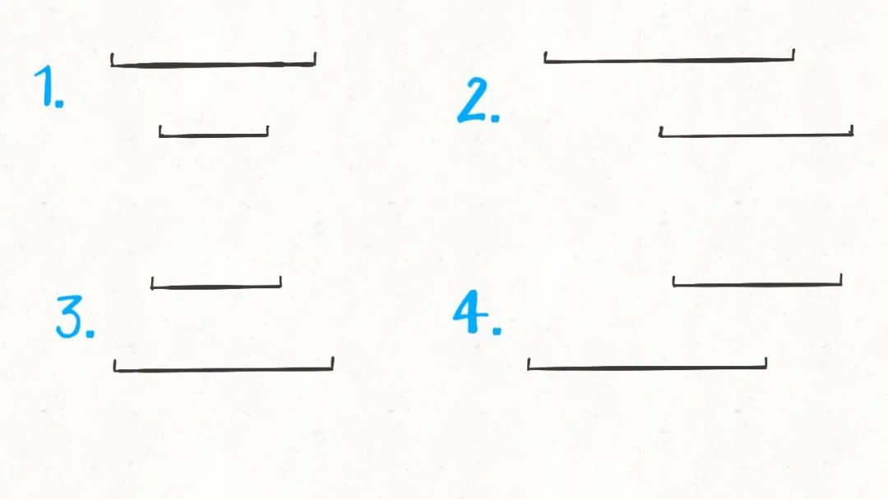

# 区间问题

所谓区间问题，就是线段问题，让你合并所有线段、找出线段的交集等等。主要有两个技巧：

**1、排序**。常见的排序方法就是按照**区间起点排序**，或者**先按照起点升序排序，若起点相同，则按照终点降序排序**。当然，如果你非要按照终点排序，无非对称操作，本质都是一样的。

**2、画图**。就是说不要偷懒，勤动手，两个区间的相对位置到底有几种可能，不同的相对位置我们的代码应该怎么去处理。

**3、堆模拟**。310周赛第3题：使用最小堆模拟区间分组

## 区间覆盖问题

[1288. 删除被覆盖区间](https://leetcode.cn/problems/remove-covered-intervals/)

给你一个区间列表，请你删除列表中被其他区间所覆盖的区间。

只有当 `c <= a` 且 `b <= d` 时，我们才认为区间 `[a,b)` 被区间 `[c,d)` 覆盖。

在完成所有删除操作后，请你返回列表中剩余区间的数目。

```
输入：intervals = [[1,4],[3,6],[2,8]]
输出：2
解释：区间 [3,6] 被区间 [2,8] 覆盖，所以它被删除了。
```

题目问我们，去除被覆盖区间之后，还剩下多少区间，**那么我们可以先算一算，被覆盖区间有多少个，然后和总数相减就是剩余区间数**。

对于这种区间问题，如果没啥头绪，首先排个序看看，比如我们按照区间的起点进行升序排序：

<div align="center">
    
</div>

排序之后，两个相邻区间可能有如下三种相对位置：

<div align="center">
    
</div>

对于这三种情况，我们应该这样处理：

对于情况一，找到了覆盖区间。

对于情况二，两个区间可以合并，成一个大区间。

对于情况三，两个区间完全不相交。

依据几种情况，我们可以写出如下代码：

```c++
class Solution {
public:
    int removeCoveredIntervals(vector<vector<int>>& intervals) {
        // 按照起点升序排列，起点相同时降序排列
        sort(intervals.begin(), intervals.end(), [](auto & a, auto & b){
            return a[0] < b[0] || (a[0] == b[0] && a[1] > b[1]);
        });
        // 记录合并区间的起点和终点
        int l = intervals[0][0];
        int r = intervals[0][1];
        int n = intervals.size();
        int cnt = 0;
        for (int i = 1; i < n; ++i) {
            // 情况一，找到覆盖区间
            if (l <= intervals[i][0] && intervals[i][1] <= r) {
                ++cnt;
            } else if (intervals[i][0] <= r && r <= intervals[i][1]) {
                // 情况二，找到相交区间，合并
                r = intervals[i][1];
            } else if (r <= intervals[i][0]) {
                // 情况三，完全不相交，更新起点和终点
                l = intervals[i][0];
                r = intervals[i][1];
            }
        }
        return n - cnt;
    }
};
```

以上就是本题的解法代码，起点升序排列，终点降序排列的目的是防止如下情况：

<div align="center">
    
</div>

## 区间合并问题

[56. 合并区间](https://leetcode.cn/problems/merge-intervals/)

以数组 `intervals` 表示若干个区间的集合，其中单个区间为 `intervals[i] = [starti, endi]` 。请你合并所有重叠的区间，并返回一个不重叠的区间数组，该数组需恰好覆盖输入中的所有区间 。

我们解决区间问题的一般思路是先排序，然后观察规律。

一个区间可以表示为`[start, end]`，前文聊的**区间调度**问题，需要按`end`排序，以便满足贪心选择性质。而对于区间合并问题，其实按`end`和`start`排序都可以，不过为了清晰起见，我们选择按`start`排序。

<div align="center">
    
</div>

**显然，对于几个相交区间合并后的结果区间`x`，`x.start`一定是这些相交区间中`start`最小的，`x.end`一定是这些相交区间中`end`最大的。**

<div align="center">
    
</div>

```c++
class Solution {
public:
    vector<vector<int>> merge(vector<vector<int>>& intervals) {
        // 按区间的 start 升序排列
        sort(intervals.begin(), intervals.end(), [](auto& a, auto& b){
            return a[0] < b[0];
        });
        int n = intervals.size();
        vector<vector<int>> res;
        res.push_back(intervals[0]);
        for (int i = 1; i < n; ++i) {
            // 与 res 中最后一个元素的右边界比较
            if (res.back()[1] >= intervals[i][0]) {
                // 重叠则覆盖
                res.back()[1] = max(res.back()[1], intervals[i][1]);
            } else {
                // 不重叠则作为新区间放入res
                res.push_back(intervals[i]);
            }
        }
        return res;
    }
};
```

代码流程如下：

<div align="center">
    
</div>

## 区间交集问题

[986. 区间列表的交集](https://leetcode.cn/problems/interval-list-intersections/)

给定两个由一些 闭**区间** 组成的列表，`firstList` 和 `secondList` ，其中 `firstList[i] = [starti, endi]` 而 `secondList[j] = [startj, endj]` 。每个区间列表都是成对 **不相交** 的，并且 **已经排序** 。

返回这 **两个区间列表的交集** 。

形式上，**闭区间** `[a, b]`（其中 `a <= b`）表示实数 `x` 的集合，而 `a <= x <= b` 。

两个闭区间的 **交集** 是一组实数，要么为空集，要么为闭区间。例如，`[1, 3]` 和 `[2, 4]` 的交集为 `[2, 3]` 。

题目很好理解，就是让你找交集，注意区间都是闭区间。

解决区间问题的思路一般是先排序，以便操作，不过题目说已经排好序了，那么可以用两个索引指针在`A`和`B`中游走，把交集找出来，代码大概是这样的：

```python
# A, B 形如 [[0,2],[5,10]...]
def intervalIntersection(A, B):
    i, j = 0, 0
    res = []
    while i < len(A) and j < len(B):
        # ...
        j += 1
        i += 1
    return res
```

不难，我们先老老实实分析一下各种情况。

首先，**对于两个区间**，我们用`[a1,a2]`和`[b1,b2]`表示在`A`和`B`中的两个区间，那么什么情况下这两个区间**没有交集**呢：

<div align="center">
    
</div>

只有这两种情况，写成代码的条件判断就是这样：

```python
if b2 < a1 or a2 < b1:
    [a1,a2] 和 [b1,b2] 无交集
```

那么，什么情况下，两个区间存在交集呢？根据命题的否定，上面逻辑的否命题就是存在交集的条件：

```python
# 不等号取反，or 也要变成 and
if b2 >= a1 and a2 >= b1:
    [a1,a2] 和 [b1,b2] 存在交集
```

接下来，两个区间存在交集的情况有哪些呢？穷举出来：

<div align="center">
    
</div>

这很简单吧，就这四种情况而已。那么接下来思考，这几种情况下，交集是否有什么共同点呢？

<div align="center">
    
</div>

我们惊奇地发现，交集区间是有规律的！如果交集区间是`[c1,c2]`，那么`c1=max(a1,b1)`，`c2=min(a2,b2)`！这一点就是寻找交集的核心，我们把代码更进一步：

```python
while i < len(A) and j < len(B):
    a1, a2 = A[i][0], A[i][1]
    b1, b2 = B[j][0], B[j][1]
    if b2 >= a1 and a2 >= b1:
        res.append([max(a1, b1), min(a2, b2)])
```

最后一步，我们的指针`i`和`j`肯定要前进（递增）的，什么时候应该前进呢？

<div align="center">
    
</div>

结合动画示例就很好理解了，是否前进，只取决于`a2`和`b2`的大小关系：

```python
while i < len(A) and j < len(B):
    # ...
    if b2 < a2:
        j += 1
    else:
        i += 1
```

