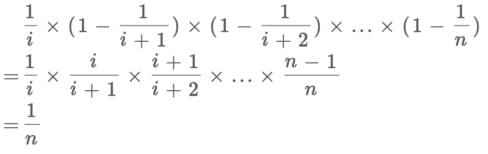

## 水塘抽样算法

> 问题描述：
>
> 给一个未知长度的序列，只遍历一次，如何在其中随机地（等概率）选择 `1/k` 个元素？

### 算法实现

**先解决只抽取一个元素的问题：**这个问题的难点在于，随机选择是「动态」的，比如说现在有 5 个元素，你已经随机选取了其中的某个元素 `a` 作为结果，但是现在再给你一个新元素 `b`，你应该留着 `a` 还是将 `b` 作为结果呢？以什么逻辑做出的选择，才能保证你的选择方法在概率上是公平的呢？

**结论：**当你遇到第 `i` 个元素时，应该有 `1/i` 的概率**选择该元素**，`1 - 1/i` 的概率**保持原有的选择**。

**代码实现：**

```C++
/* 返回数组中一个随机索引的值 */
int getRandom(vector<int>& nums) {
    srand((unsigned)time(NULL)); // 设置随机种子
    int res = 0;
    // while 循环遍历链表
    for(int i = 1; i <= nums.size(); i++) {
        if(0 == rand() % i) res = nums[i-1];
    }
    return res;
}
```

对于概率算法，代码往往都是很浅显的，但是这种问题的关键在于证明，你的算法为什么是对的？为什么每次以 `1/i` 的概率更新结果就可以保证结果是平均随机（uniform random）？

**证明**：假设总共有 `n` 个元素，我们要的随机性无非就是每个元素被选择的概率都是 `1/n` 对吧，那么对于第 `i` 个元素，它被选择的概率就是：

<div align="center"></div>

公式解释：第 `i` 个元素被选择的概率是 `1/i`，第 `i+1` 次不被替换的概率是 `1 - 1/(i+1)`，以此类推，相乘就是第 `i` 个元素最终被选中的概率，就是 `1/n`。

因此，该算法的逻辑是正确的。

**同理，如果要随机选择 `k` 个数，只要在第 `i` 个元素处以 `k/i` 的概率选择该元素，以 `1 - k/i` 的概率保持原有选择即可**。代码如下

```C++
/* 返回数组中k个随机索引的值 */
int getRandom(vector<int>& nums) {
    srand((unsigned)time(NULL)); // 设置随机种子
    vector<int> res;
    // 使用nums前k个元素初始化res，因为如果nums中的元素小于等于k时，我们一定会取出这些元素
    for(int i = 0; i < k; i++) {
        res.push_buck(nums[i]);
	}
    // while 循环遍历链表
    for(int j = 1; j <= nums.size(); j++) {
        int r = rand() % j;
        if(r < k) res[r] = nums[j];
    }
    return res;
}
```

对于数学证明，和上面区别不大：

<div align="center"></div>

因为虽然每次更新选择的概率增大了 `k` 倍，但是选到具体第 `i` 个元素的概率还是要乘 `1/k`，也就回到了上一个推导。

