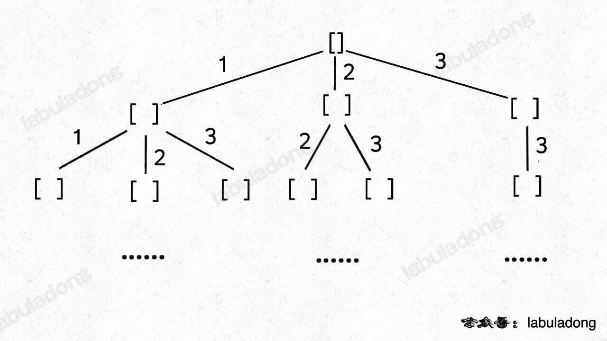

# 排列/组合/子集问题

无论是排列、组合还是子集问题，简单说无非就是让你从序列 `nums` 中以给定规则取若干元素，主要有以下几种变体：

**形式一、元素无重不可复选，即 `nums` 中的元素都是唯一的，每个元素最多只能被使用一次，这也是最基本的形式**。

以组合为例，如果输入 `nums = [2,3,6,7]`，和为 7 的组合应该只有 `[7]`。

**形式二、元素可重不可复选，即 `nums` 中的元素可以存在重复，每个元素最多只能被使用一次**。

以组合为例，如果输入 `nums = [2,5,2,1,2]`，和为 7 的组合应该有两种 `[2,2,2,1]` 和 `[5,2]`。

**形式三、元素无重可复选，即 `nums` 中的元素都是唯一的，每个元素可以被使用若干次**。

以组合为例，如果输入 `nums = [2,3,6,7]`，和为 7 的组合应该有两种 `[2,2,3]` 和 `[7]`。

当然，也可以说有第四种形式，即元素可重可复选。但既然元素可复选，那又何必存在重复元素呢？元素去重之后就等同于形式三，所以这种情况不用考虑。

上面用组合问题举的例子，但排列、组合、子集问题都可以有这三种基本形式，所以共有 9 种变化。

除此之外，题目也可以再添加各种限制条件，比如让你求和为 `target` 且元素个数为 `k` 的组合，那这么一来又可以衍生出一堆变体，怪不得面试笔试中经常考到排列组合这种基本题型。

**但无论形式怎么变化，其本质就是穷举所有解，而这些解呈现树形结构，所以合理使用回溯算法框架，稍改代码框架即可把这些问题一网打尽**。

<div align="center">
    <br><br>
    
</div>


## 子集（元素无重不可复选）

题目给你输入一个无重复元素的数组 `nums`，其中每个元素最多使用一次，请你返回 `nums` 的所有子集。

比如输入 `nums = [1,2,3]`，算法应该返回如下子集：

```java
[ [],[1],[2],[3],[1,2],[1,3],[2,3],[1,2,3] ]
```

即，子集树的所有结点组成的树枝集合！

```java
List<List<Integer>> res = new LinkedList<>();
// 记录回溯算法的递归路径
LinkedList<Integer> track = new LinkedList<>();

// 主函数
public List<List<Integer>> subsets(int[] nums) {
    backtrack(nums, 0);
    return res;
}

// 回溯算法核心函数，遍历子集问题的回溯树
void backtrack(int[] nums, int start) {
	// 无需条件判断，因为遍历到的位置都符合要求
    // 前序位置，每个节点的值都是一个子集
    res.add(new LinkedList<>(track));
    
    // 回溯算法标准框架
    for (int i = start; i < nums.length; i++) {
        // 做选择
        track.addLast(nums[i]);
        // 通过 start 参数控制树枝的遍历，避免产生重复的子集
        backtrack(nums, i + 1);
        // 撤销选择
        track.removeLast();
    }
}
```

## 组合（元素无重不可复选）

如果你能够成功的生成所有无重子集，那么你稍微改改代码就能生成所有无重组合了。

你比如说，让你在 `nums = [1,2,3]` 中拿 2 个元素形成所有的组合，你怎么做？

稍微想想就会发现，大小为 2 的所有组合，不就是所有大小为 2 的子集嘛。

**所以我说组合和子集是一样的：大小为 `k` 的组合就是大小为 `k` 的子集**。

给定两个整数 `n` 和 `k`，返回范围 `[1, n]` 中所有可能的 `k` 个数的组合。比如 `combine(3, 2)` 的返回值应该是：

```c++
[ [1,2],[1,3],[2,3] ]
```

```java
List<List<Integer>> res = new LinkedList<>();
// 记录回溯算法的递归路径
LinkedList<Integer> track = new LinkedList<>();

// 主函数
public List<List<Integer>> combine(int n, int k) {
    backtrack(1, n, k);
    return res;
}

void backtrack(int start, int n, int k) {
    // base case
    if (k == track.size()) {
        // 遍历到了第 k 层，收集当前节点的值
        res.add(new LinkedList<>(track));
        return;
    }
    
    // 回溯算法标准框架
    for (int i = start; i <= n; i++) {
        // 选择
        track.addLast(i);
        // 通过 start 参数控制树枝的遍历，避免产生重复的子集
        backtrack(i + 1, n, k);
        // 撤销选择
        track.removeLast();
    }
}
```

## 排列（元素无重不可复选）

**排列问题本身就是让你穷举元素的位置，`nums[i]` 之后也可以出现 `nums[i]` 左边的元素，所以之前的那一套玩不转了，需要额外使用 `used` 数组来标记哪些元素还可以被选择**。

用 `used` 数组标记已经在路径上的元素避免重复选择，然后收集所有叶子节点上的值，就是所有全排列的结果：

```java
List<List<Integer>> res = new LinkedList<>();
// 记录回溯算法的递归路径
LinkedList<Integer> track = new LinkedList<>();
// track 中的元素会被标记为 true
boolean[] used;

/* 主函数，输入一组不重复的数字，返回它们的全排列 */
public List<List<Integer>> permute(int[] nums) {
    used = new boolean[nums.length];
    backtrack(nums);
    return res;
}

// 回溯算法核心函数
void backtrack(int[] nums) {
    // base case，到达叶子节点
    if (track.size() == nums.length) {
        // 收集叶子节点上的值
        res.add(new LinkedList(track));
        return;
    }

    // 回溯算法标准框架
    for (int i = 0; i < nums.length; i++) {
        // 已经存在 track 中的元素，不能重复选择
        if (used[i]) {
            continue;
        }
        // 做选择
        used[i] = true;
        track.addLast(nums[i]);
        // 进入下一层回溯树
        backtrack(nums);
        // 取消选择
        track.removeLast();
        used[i] = false;
    }
}
```

## 子集/组合（元素可重不可复选）

刚才讲的标准子集问题输入的 `nums` 是没有重复元素的，但如果存在重复元素，怎么处理呢？

比如输入 `nums = [1,2,2]`，你应该输出：

```java
[ [],[1],[2],[1,2],[2,2],[1,2,2] ]
```

按照之前的思路画出子集的树形结构，显然，两条值相同的相邻树枝会产生重复：

<div align="center">
	
</div>

```c++
[ 
    [],
    [1],[2],[2'],
    [1,2],[1,2'],[2,2'],
    [1,2,2']
]
```

所以我们需要进行剪枝，如果一个节点有多条值相同的树枝相邻，则只遍历第一条，剩下的都剪掉，不要去遍历，**体现在代码上，需要先进行排序，让相同的元素靠在一起，如果发现 `nums[i] == nums[i-1]`，则跳过**：

```java
List<List<Integer>> res = new LinkedList<>();
LinkedList<Integer> track = new LinkedList<>();

public List<List<Integer>> subsetsWithDup(int[] nums) {
    // 先排序，让相同的元素靠在一起
    Arrays.sort(nums);
    backtrack(nums, 0);
    return res;
}

void backtrack(int[] nums, int start) {
    // 前序位置，每个节点的值都是一个子集
    res.add(new LinkedList<>(track));
    
    for (int i = start; i < nums.length; i++) {
        // 剪枝逻辑，值相同的相邻树枝，只遍历第一条
        if (i > start && nums[i] == nums[i - 1]) {
            continue;
        }
        track.addLast(nums[i]);
        backtrack(nums, i + 1);
        track.removeLast();
    }
}
```

如果是带重复元素的组合问题，则只需要在 `res.add` 之前添加条件判断，以子集/组合和为例：

```java
List<List<Integer>> res = new LinkedList<>();
// 记录回溯的路径
LinkedList<Integer> track = new LinkedList<>();
// 记录 track 中的元素之和
int trackSum = 0;

public List<List<Integer>> combinationSum2(int[] candidates, int target) {
    if (candidates.length == 0) {
        return res;
    }
    // 先排序，让相同的元素靠在一起
    Arrays.sort(candidates);
    backtrack(candidates, 0, target);
    return res;
}

// 回溯算法主函数
void backtrack(int[] nums, int start, int target) {
    // base case，达到目标和，找到符合条件的组合
    if (trackSum == target) {
        res.add(new LinkedList<>(track));
        return;
    }
    // base case，超过目标和，直接结束
    if (trackSum > target) {
        return;
    }

    // 回溯算法标准框架
    for (int i = start; i < nums.length; i++) {
        // 剪枝逻辑，值相同的树枝，只遍历第一条
        if (i > start && nums[i] == nums[i - 1]) {
            continue;
        }
        // 做选择
        track.add(nums[i]);
        trackSum += nums[i];
        // 递归遍历下一层回溯树
        backtrack(nums, i + 1, target);
        // 撤销选择
        track.removeLast();
        trackSum -= nums[i];
    }
}
```

## 排列（元素可重不可复选）

排列问题的输入如果存在重复，比子集/组合问题稍微复杂一点

```java
List<List<Integer>> res = new LinkedList<>();
LinkedList<Integer> track = new LinkedList<>();
boolean[] used;

public List<List<Integer>> permuteUnique(int[] nums) {
    // 先排序，让相同的元素靠在一起
    Arrays.sort(nums);
    used = new boolean[nums.length];
    backtrack(nums);
    return res;
}

void backtrack(int[] nums) {
    if (track.size() == nums.length) {
        res.add(new LinkedList(track));
        return;
    }

    for (int i = 0; i < nums.length; i++) {
        if (used[i]) {
            continue;
        }
        // 新添加的剪枝逻辑，固定相同的元素在排列中的相对位置
        if (i > 0 && nums[i] == nums[i - 1] && !used[i - 1]) {
            continue;
        }
        track.add(nums[i]);
        used[i] = true;
        backtrack(nums);
        track.removeLast();
        used[i] = false;
    }
}
```

对比一下之前的标准全排列解法代码，这段解法代码只有两处不同：

1、对 `nums` 进行了排序。

2、添加了一句额外的剪枝逻辑。

## 子集/组合（元素无重可复选）

输入数组无重复元素，但每个元素可以被无限次使用

**标准的子集/组合问题是如何保证不重复使用元素的**？答案在于 `backtrack` 递归时输入的参数 `start`：

```java
// 无重组合的回溯算法框架
void backtrack(int[] nums, int start) {
    for (int i = start; i < nums.length; i++) {
        // ...
        // 递归遍历下一层回溯树，注意参数
        backtrack(nums, i + 1);
        // ...
    }
}
```

这个 `i` 从 `start` 开始，那么下一层回溯树就是从 `start + 1` 开始，从而保证 `nums[start]` 这个元素不会被重复使用，那么反过来，如果我想让每个元素被重复使用，我只要把 `i + 1` 改成 `i` 即可：

这相当于给之前的回溯树添加了一条树枝，在遍历这棵树的过程中，一个元素可以被无限次使用：

<div align="center">
	
</div>
代码如下：


```java
List<List<Integer>> res = new LinkedList<>();
// 记录回溯的路径
LinkedList<Integer> track = new LinkedList<>();
// 记录 track 中的路径和
int trackSum = 0;

public List<List<Integer>> combinationSum(int[] candidates, int target) {
    if (candidates.length == 0) {
        return res;
    }
    backtrack(candidates, 0, target);
    return res;
}

// 回溯算法主函数
void backtrack(int[] nums, int start, int target) {
    // base case，找到目标和，记录结果
    if (trackSum == target) {
        res.add(new LinkedList<>(track));
        return;
    }
    // base case，超过目标和，停止向下遍历
    if (trackSum > target) {
        return;
    }

    // 回溯算法标准框架
    for (int i = start; i < nums.length; i++) {
        // 选择 nums[i]
        trackSum += nums[i];
        track.add(nums[i]);
        // 递归遍历下一层回溯树
        // 同一元素可重复使用，注意参数
        backtrack(nums, i, target);
        // 撤销选择 nums[i]
        trackSum -= nums[i];
        track.removeLast();
    }
}
```

## 排列（元素无重可复选）

元素无重可复选，就不叫排列了，力扣上没有类似的题目，暂时略
