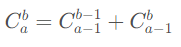

# 组合数

## 算法一

使用公式如下（杨辉三角中也使用这个递推公式）：

<div align="center">
    
</div>
**解析：**可以理解为从 a 个数中选出 b 个数的总方案数，有两种情况：

- 情况一：选取某个数，那么此时只需要从剩下的 a-1 个中选出 b-1 个
- 情况二：不选取某个数，那么此时从剩下的 a-1 个中选出 b 个

**时间复杂度：** O(n^2)

```c++
const int mod = 1e9 + 7;
long long f[2010][2010];
for (int i = 0; i <= 2000; i++) {
    f[i][0] = f[i][i] = 1; // 边界
    for (int j = 1; j < i; j++) {
        f[i][j] = (f[i - 1][j - 1] + f[i - 1][j]) % mod;
    }
}
// f[i][j]=C_i^j
```

