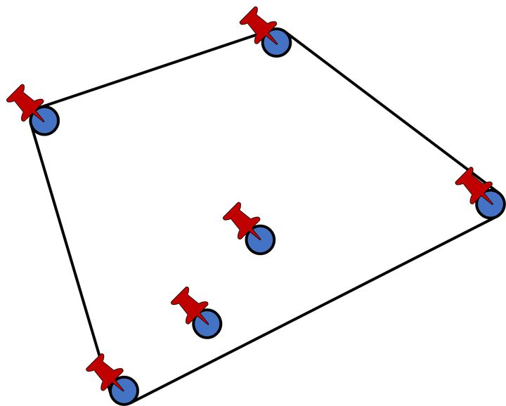

## 求凸包问题

> 凸包（Convex Hull）是一个计算几何（图形学）中的概念。[经典凸包问题](https://leetcode.cn/problems/erect-the-fence/)
>

在坐标系中的某些点组成的凸多边形，这个多边形能把所有点都“包”起来，同时凸多边形的边长最短。如下图中的4个红点把6个点全部包含起来了。

<div align="center"></div>

### Andrew算法

$Andrew$ 使用单调链算法，该算法与 $Graham$ 扫描算分类似。它们主要的不同点在于凸壳上点的顺序。与  $Graham$ 扫描算法按照点比较顺序排序不同，**我们按照点的 $x$ 坐标排序，如果两个点又相同的 $x$ 坐标，那么就按照它们的 $y$ 坐标排序。**显然排序后的**最大值与最小值一定在凸包上**，而且因为是凸多边形，我们如果从一个点出发逆时针走，轨迹总是「左拐」的，一旦出现右拐，就说明这一段不在凸包上，因此我们可以用一个**单调栈**来维护上下凸壳。

仔细观察可以发现，最小值与最大值一定位于凸包的最左边与最右边，从左向右看，我们将凸壳考虑成 $2$ 个子边界组成：**上凸壳**和**下凸壳**。下凸壳一定是从最小值一直「左拐」直到最大值，上凸壳一定是从最大值「左拐」到最小值，**因此我们首先升序枚举求出下凸壳，然后降序求出上凸壳。**

我们首先将**最初始的两个点**添加到凸壳中，然后遍历排好序的 **trees** 数组。对于每个新的点，我们检查当前点**是否在最后两个点的逆时针方向上，轨迹是否是左拐**。如果是的话，当前点直接被压入凸壳 hull 中，$cross$ 函数返回的结果为正数；如果不是的话，$cross$ 返回的结果为负数，并且可以知道栈顶的元素在凸壳里面而不是凸壳边上，则需要从 hull 中弹出元素直到当前点处于栈顶两个点的逆时针方向上。

这个方法中，**我们不需要显式地考虑共线的点**，因为这些点已经按照 $x$ 坐标排好了序。所以如果有共线的点，它们已经被隐式地按正确顺序考虑了。通过这样，我们会一直遍历到 $x$ 坐标最大的点为止。但是凸壳还没有完全求解出来。目前求解出来的部分只包括凸壳的下半部分。

现在我们需要求出凸壳的上半部分。我们继续找下一个逆时针的点并将不在边界上的点从栈中弹出，但**这次我们遍历的顺序是按照 $x$ 坐标从大到小**，我们**只需要从后往前遍历有序数组 trees 即可**。我们将新的上凸壳的值添加到之前的 hull 数组中。最后 hull 数组返回了我们需要的边界上的点。需要注意的是，由于我们需要检测上凸壳最后加入的点是否合法，此时需要再次插入最左边的点 tree[0] 进行判别。

```C++
class Solution {
public:
    // 计算向量叉乘，判断方向
    int cross(const vector<int>& p, const vector<int>& q, const vector<int>& r) {
        int p_q_x = q[0] - p[0], p_q_y = q[1] - p[1];  // 向量a
        int q_r_x = r[0] - q[0], q_r_y = r[1] - q[1];  // 向量b
        return p_q_x * q_r_y - p_q_y * q_r_x;  // a.x*b.y - a.y*b.x
    }
    // Andrew 算法
    vector<vector<int>> outerTrees(vector<vector<int>>& trees) {
        // 特判
        int n = trees.size();
        if(n < 4) {
            return trees;
        }
        // 排序
        sort(trees.begin(), trees.end(), [](const vector<int>& a, const vector<int>& b) ->bool {
            if(a[0] == b[0]) return a[1] < b[1];
            return a[0] < b[0];
        });
        // 关键数据结构——单调栈
        vector<int> hull;  // 存下标
        vector<bool> used(n, false);  // 剪枝
        /* 求出凸包的下半部分 */
        // 把最左边的2个点放入
        hull.emplace_back(0); // hull[0] 需要入栈两次，不进行标记
        for(int i = 1; i < n; i++) {
            if(!used[i]) {
                while(hull.size() > 1 && cross(trees[hull[hull.size() - 2]], trees[hull.back()], trees[i]) < 0) {
                    used[hull.back()] = false;
                    hull.pop_back();
                }
                used[i] = true;
                hull.emplace_back(i);
            }
        }
        /* 求出凸包的上半部分 */
        // 从导数第2个位置向前遍历
        int m = hull.size();
        for(int i = n - 2; i >= 0; i--) {
            if(!used[i]) {
                while(hull.size() > m && cross(trees[hull[hull.size() - 2]], trees[hull.back()], trees[i]) < 0) {
                    used[hull.back()] = false;
                    hull.pop_back();
                }
                used[i] = true;
                hull.emplace_back(i);
            }
        }
        hull.pop_back();  // hull[0] 同时参与凸包的上半部分检测，因此需去掉重复的 hull[0]
        // 返回值
        vector<vector<int>> res;
        for(auto& pos : hull) {
            res.emplace_back(trees[pos]);
        }
        return res;
    }
};
```

### Reference

- 推荐 leetcode 的[算法介绍](https://leetcode.cn/problems/erect-the-fence/solution/an-zhuang-zha-lan-by-leetcode-solution-75s3/)

- https://zhuanlan.zhihu.com/p/340442313

- https://blog.csdn.net/u011001084/article/details/72768075
- https://blog.csdn.net/lemonxiaoxiao/article/details/108619552

