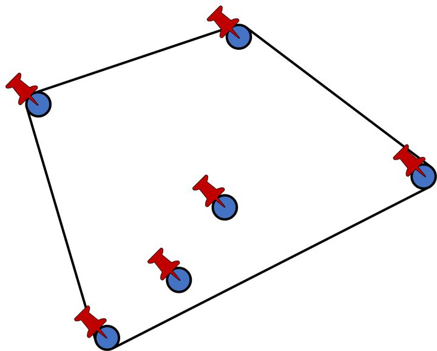

## 凸包问题

> 凸包（Convex Hull）是一个计算几何（图形学）中的概念。
>

在坐标系中的某些点组成的凸多边形，这个多边形能把所有点都“包”起来，同时凸多边形的边长最短。如下图中的4个红点把6个点全部包含起来了。

### Andrew算法

### Reference

- https://zhuanlan.zhihu.com/p/340442313

- https://blog.csdn.net/u011001084/article/details/72768075
- https://blog.csdn.net/lemonxiaoxiao/article/details/108619552

